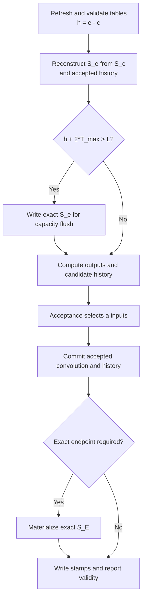

# Kimi-K3 Replay-SSM refactor — controlled-English edition

[Normative English design](kda-replay-ssm-design.md) |
[简体中文](kda-replay-ssm-design.zh-CN.md)

Status: proposal for design discussion.

This file is a simplified version of the normative English design. It uses
controlled-English rules that are inspired by ASD-STE100. It is not a certified
ASD-STE100 document. The normative English design has authority if the files
disagree.

## 1. Purpose

The current Kimi-K3 decode paths use two methods to maintain KDA state.

- Standard decode writes a complete recurrent state after each token.
- Speculative decode verifies a candidate window. It then replays the accepted
  inputs and writes a complete recurrent state.

The speculative path stores candidate intermediates in a workspace. This
workspace is valid for one decode round only. It is not a persistent history
cache.

The new design has two main goals:

1. Use one state protocol for standard decode and speculative decode.
2. Keep accepted K/U/D history in a buffer owned by each KDA layer, so later
   rounds of the same request can reuse it.

Standard decode uses the same protocol with `T=1`. Speculative decode uses the
protocol with `T>1`.

The design does not change the model weights or the acceptance rule.

## 2. Current implementation and target implementation

The current implementation has recurrent-state cache, convolution-state cache,
and a per-round speculative workspace. It does not have persistent accepted
K/U/D history.

| Item | Current implementation | Replay-SSM target |
| --- | --- | --- |
| State at round entry | The previous round wrote exact recurrent `S_e`. | Exact checkpoint `S_c` and accepted history `[c,e)` represent logical `S_e`. |
| Standard decode | Update and write the complete recurrent state for each token. | Use `T=1`. Add one accepted history entry. Materialize complete state only when required. |
| Speculative verify | Store current-window projections and intermediates in per-round workspace. | Produce candidate K/U/D history `[e,e+w)`. |
| Work after acceptance | Replay the accepted prefix. Write exact `S_e`. | Promote `[e,e+a)` to persistent history. Exclude rejected `[e+a,e+w)`. Do not run post-acceptance recurrent replay. |
| History lifetime | Candidate intermediates are valid for one round. | Accepted history is valid across rounds of the same live request. |
| History owner | The backend owns per-round workspace. | Each KDA layer owns a fixed-capacity persistent buffer. |
| Complete-state write | Standard decode writes each step. Speculative decode writes after replay. | Write at a capacity flush, an aligned reusable checkpoint, or another explicit snapshot boundary. |
| Reuse scope | Reuse is inside one verify/commit round. | Later rounds of the same request reuse accepted history. Other requests do not reuse it. |
| Decode protocol | Standard and speculative decode use different state-maintenance behavior. | Both modes use one prepare, reconstruct, forward, acceptance, and commit protocol. |

In this document, **history reuse** has one meaning. The accepted part of the
current candidate window becomes request-local history. A later round of the
same request reads this history.

History reuse does not mean cross-request prefix reuse. A prefix hit starts from
an exact checkpoint and empty history. A rejected suffix never becomes history.

## 3. Scope

The first target is Kimi-K3 on NVIDIA Blackwell.

- Activation type: BF16.
- Recurrent-state type: FP32.
- Head dimension: 128.
- Maximum input width: `T_max=1` or `T_max=4`.
- Validation weights: real NVFP4 weights.
- Tensor parallel size: TP8.

The following items are not in this replacement:

- Output-only attention.
- A change to sampling or acceptance rules.
- Live request transfer between prefill and decode workers.
- Buffered replay for other linear-attention models.
- Dynamic history capacity.
- Window-parallel KDA.

The repository has an opt-in ReplaySSM path for selected Qwen GDN models. This
design does not change that path. That path is not a reason to keep a
legacy/new selector for KDA. A later design can define common GDN and KDA
interfaces.

## 4. Upstream requirements

This design uses two related changes.

| Work | Status | Function |
| --- | --- | --- |
| [Upstream #1597](https://github.com/lightseekorg/tokenspeed/pull/1597) | Merged | Tracks the exact computed frontier and pending materialized boundaries. |
| [Fork #3](https://github.com/byshiue/tokenspeed/pull/3) | Under review | Adds bounded live-state retention with `max_state_lag_tokens`. |

During decode, `Request::NumComputedTokens()` is `TokenSize() - 1`. The last
sampled token is not included because the model did not process it as an input.

The scheduler must keep proof of a materialized boundary until admission and
publication succeed.

## 5. State model

For one request and one KDA layer, use these variables:

- `c`: position of the exact recurrent checkpoint.
- `e`: number of accepted and computed input tokens.
- `w`: width of the current candidate window. `w <= T_max`.
- `a`: number of accepted inputs in the current window.
- `L`: logical history capacity.
- `h`: accepted history length. `h = e - c`.

The state relation is:

```text
exact recurrent S_c + accepted history [c,e) = logical recurrent S_e
                      candidate history [e,e+w) is not committed
```

For each token, history stores these FP32 values:

- Normalized key `K`.
- Correction vector `U`.
- Per-key-channel multiplicative decay `D`.

The query is not persistent history. Rejected candidate data is not logical
state, even if its bytes remain in allocated memory.

The convolution window is exact at endpoint `e`. The recurrent checkpoint can
remain at `c`. The checkpoint and accepted history together represent the live
state.

Only a materialized exact checkpoint can be used for prefix reuse or transfer.

## 6. Ownership

| Owner | Required responsibility |
| --- | --- |
| LCM cache | Own exact recurrent and convolution checkpoints. Allocate, protect, publish, and reclaim checkpoint memory. Do not store replay history. |
| C++ scheduler | Own state demand, admission, bounded checkpoint retention, publication, recovery, and request lifecycle. Do not allocate or inspect layer history. |
| Runtime and KDA layer | Assign a stable request slot and generation. Own the fixed-capacity K/U/D history buffer for each layer. Reset reused slots safely. |
| `tokenspeed-kernel` | Validate layer-buffer metadata. Reconstruct state. Compute outputs and history. Write selected state, convolution windows, and stamps. |

Each KDA layer owns one persistent, fixed-address replay-history ring. Runtime
indexes the ring with a request slot and generation. This ring is not an LCM
cache group. It is a narrow backend-private-state exception. History is bounded,
used only by KDA, excluded from prefix reuse and transfer, and valid only while
the request stays live on the same worker. Exact checkpoints remain in LCM.

## 7. Checkpoint cache and layer-history contract

### 7.1 Bounded checkpoint retention

`max_state_lag_tokens=d` tells the allocator how far a live checkpoint can lag
behind computed progress.

The value changes retention only. It does not change prefix identity or state
block size.

For state-block span `G` and progress `p`, a slot can expire only if its index is
less than:

```text
max(0, floor((p - d - 1) / G))
```

The checkpoint at endpoint `c` is in slot `floor((c-1)/G)`. Endpoint zero uses
the initial zero state.

Admission, victim selection, reservation, and reclaim must use the same rule.
The startup budget must add `ceil(d/G)` state blocks for each live request.

All Python and C++ interfaces must carry the same explicit lag value. Existing
recipes use zero lag.

### 7.2 Request-local KDA layer buffer

Each KDA layer allocates a fixed-address GPU buffer at startup. Use this logical
shape for K, U, and D:

```text
[max_request_slots, L, local_heads, ...]
```

This buffer is independent of LCM page allocation. It adds no dynamic LCM
demand. `max_request_slots` must cover the maximum number of requests that can
stay resident on the worker. Reject the configuration at startup if runtime can
exhaust the layer-buffer slots.

Use these relations:

```text
d = L - T_max
L >= 2 * T_max
```

The layer buffer has these rules:

- Assign one stable request slot while the request is live.
- Use the same slot index in every KDA layer.
- Store a generation, checkpoint position, accepted endpoint, ring origin, and
  position stamps for each slot.
- A row is valid only when its generation and absolute token position match.
- A kernel can map an absolute token position to a row modulo `L`.
- Write K/U/D before the matching position stamp.
- Keep rejected rows invalid. A later round can overwrite them.
- Start prefill completion and a prefix hit with an exact LCM checkpoint and
  empty layer history.
- Do not store history for the complete prefill prompt.
- Wait for all in-flight users before slot reuse. Then increment the generation
  and reset metadata.
- Do not publish, canonicalize, prefix-match, transfer, or write layer history
  to Host cache.
- Treat a stale generation or position stamp as an invariant failure. Do not
  treat it as empty history.

### 7.3 Memory estimate

One FP32 history entry uses:

```text
4 * (2 * D_k + D_v) bytes per head
```

For `D_k=D_v=128`, one entry uses 1.5 KiB per head. A complete state uses
64 KiB per head. The history entry is approximately 43 times smaller.

For TP8 Kimi-K3, use 69 local KDA layers and 12 local heads.

- `L=8`: approximately 9.7 MiB per configured request slot per GPU.
- `L=16`: approximately 19.4 MiB per configured request slot per GPU.
- `L=16` and 256 request slots: approximately 4.85 GiB per GPU.

The layer buffers allocate this capacity at startup. These values do not include
retained LCM checkpoint blocks, generations, stamps, or runtime scratch.

## 8. Scheduler and lifecycle

The scheduler must keep one admission and forward path. It must not inspect
per-layer history. It must not reduce the verify width to fit backend storage.

The scheduler has no replay-history demand. Runtime owns layer-buffer slots.
The device determines the capacity-flush mask for each request.


Only a materialized exact endpoint can become a reusable checkpoint. These
events do not prove materialization:

- Crossing an aligned boundary.
- Allocating a block.
- Committing a convolution window.
- Planning a capacity flush.

The scheduler must publish before it reclaims the required storage. A failed
admission must not consume pending materialization evidence.

Lifecycle rules:

- **Prefill to decode:** Start from exact state and empty layer history.
- **Prefix hit:** Start from an exact prefix checkpoint and empty layer history.
- **Aligned accepted endpoint:** Materialize the actual endpoint before
  publication.
- **Retraction:** Restore an exact prefix checkpoint. Recompute the suffix. Do
  not export live history as exact state. Invalidate its generation before
  slot reuse.
- **Finish or cancel:** Keep storage until all in-flight readers and writers
  finish. Then increment its generation and reset metadata.
- **Live handoff or P-D:** Reject this configuration until a separate design
  adds quiescent materialization and transfer.

GPU validity must use the normal forward-result path. CPU checks and rank
agreement must finish before scheduler feedback reports success.

## 9. Decode protocol

The runtime uses three operations.

| Operation | Input | Output or side effect |
| --- | --- | --- |
| Prepare | Checkpoint tables, request slots and generations, accepted endpoints, valid widths, `L`, and `T_max`. | Checkpoint positions, history lengths, flush masks, and layer-buffer validity flags in fixed buffers. |
| Forward | Q/K/V and gate producers, checkpoint views, layer-owned history views, and prepared positions. | Verify output and candidate K/U/D in the request slot. A capacity flush can write exact pre-candidate state. |
| Accepted commit | Accepted input counts, candidate data, endpoint masks, request slots, and generations. | Accepted convolution window, selected exact recurrent endpoint, and ordered layer-history stamps. |

Standard and speculative decode use this flow:



`a` includes the target input. Do not add one more token. Standard decode uses
`a=1`. Padding uses `a=0` and must not change state.

A capacity flush writes old accepted endpoint `e`. It must not include candidate
tokens. An endpoint writer after acceptance can write new endpoint `E=e+a`.

Forward already reconstructed `S_e`. A capacity flush stores this state. It does
not run another recurrence.

Metadata and scratch addresses must remain fixed for CUDA graph capture. The
buffers must support the runtime maximum batch size, not only captured sizes.

## 10. Capacity-flush rule

Use this flush test:

```text
h + 2 * T_max > L
```

This rule reserves two windows:

1. Up to `T_max` accepted inputs from this round.
2. Up to `T_max` candidates for the next round.

If this round does not flush:

```text
h_next = h + a
a <= T_max
h_next + T_max <= L
```

Therefore, the safe no-flush condition is:

```text
h + 2 * T_max <= L
```

For `L=8` and `T_max=4`, any `h>0` causes a flush. This capacity is legal but
usually gives poor amortization. `L=16` allows history to persist for more
rounds.

The two-window rule is a buffer-lifecycle rule. It is not an SSM mathematical
requirement. Do not change it to a one-window rule without a separate design for
flush ordering, in-flight readers, reclaim, and admission.

## 11. Numerical contract

Both PRs use the fixed gates in the normative design, Section 7.
Keep K, U and token-local D in FP32. Do not store cumulative decay.
For state layout [value_dim, key_dim], use:

```text
S_(i+1) = S_i * D_i[None, :] + U_i[:, None] * K_i[None, :]
```

Output tolerance is atol=2e-2 and rtol=2e-2 after BF16 conversion.
Scalar-reference state tolerance is atol=3e-2 and rtol=2e-2.
For accepted-state comparison with main, use atol=1e-5 and rtol=1e-3.
Keep the stricter limits in existing regression tests.
Report maximum and RMS error. Reject NaN and Inf.
Convolution endpoints, positions, accepted counts and padding effects must match exactly.
The fixed greedy corpus must produce the same tokens and acceptance counts.
AIME 2026 must not lose correct answers in the paired deterministic test.
Keep the same prompts, sampling settings and answer parser.

Do not relax a failed gate after implementation.
Tensor Core reassociation is outside these two PRs.

Main uses BF16 convolution and gate outputs for verify.
Main uses FP32 convolution and gate results for accepted-state replay.
Create recovery records from the FP32 results.
Do not use the rounded verify inputs for these records.

PR1 must preserve both calculations.
One producer can keep two state chains in registers.
Use one chain for verify outputs. Use the other chain for recovery records.
Measure the cost of the second chain.
Fuse producers only when both numerical contracts still pass.
Start both chains from the same FP32 state and BF16 convolution window.
Use main replay's tap order and FP32 activation and gate calculations.
Create U from the record chain's own state after decay.
Do not make these records by casting verify inputs.
The copied recovery kernel reads the FP32 K/U/D records directly.

PR1 does not change standard decode.
For PR2, compare T=1 with main's standard fused decode.
That kernel calculates convolution and gates in FP32 registers.
Use the strict state tolerance. A width-one speculative test is not sufficient.

PR1 commits an exact checkpoint after each round in its multi-round tests.
PR2 must meet the same strict state limit with retained history.
Test history lengths up to L-T_max and wraparound at L=8/16/32.
Report verify-only time, total KDA time, registers, spills and occupancy.
A performance failure does not permit relaxed accuracy limits.

## 12. Expected benefit and cost

The expected benefits are:

- Remove post-acceptance recurrent replay.
- Reduce complete-state writes.
- Put accepted commit in the unified graph-stable decode lifecycle.

The ReplaySSM blog uses a different baseline. Its concurrency gains include the
removal of per-draft full-state snapshots. TokenSpeed Kimi-K3 does not have
those snapshots. Do not use the blog's concurrency numbers as an expectation
for this work.

The expected costs are:

- Persistent request-local history.
- Retained lagging checkpoints.
- History reads and reconstruction arithmetic.
- Metadata and commit work.
- Complete-state writes at flush and snapshot boundaries.

Output-only attention is not in scope. Each round still reads complete `S_c`.
Full-state read traffic does not decrease. Reconstruction cost grows with `h`.

The live checkpoint has lag bound d=L-T_max. Prefix recovery has no such bound.
A published checkpoint can be unavailable after eviction. Measure recomputed tokens.
A private capacity-flush checkpoint is not a new retraction source.

The final PR must test:

```text
L in {8, 16, 32} x target concurrency
```

Report these measurements:

- Latency.
- Throughput.
- GPU memory.
- Flush frequency.
- Retraction recovery cost.
- Acceptance.

Select the recipe default from these results. Do not select it from the legal
capacity bounds only.

## 13. Delivery and acceptance

The rules below follow the approved normative design. They apply to both PRs.

### Two-PR implementation plan

The feature lands through two implementation PRs. Each merged revision has one
serving path. Neither PR adds a legacy/new environment variable, CLI option or
runtime selector. A separate worktree or baseline binary may be used for
offline comparison.

Upstream #1597 is a prerequisite for both PRs. Bounded checkpoint retention from
fork #3, or an equivalent reviewed change, is a prerequisite for PR2. Small
behavior-preserving changes to shared request-slot or decode descriptors may
land separately only when the current implementation uses and validates them;
they must not install an unused Replay-SSM branch.

#### Gate before PR1: one composable replay record

PR1 and PR2 use the FP32 K/U/D record defined in Section 3. Recovery consumes
`(S_c, record_view, c, E)`. The view contains buffer strides, capacity `R`,
request slot, generation and absolute-position stamps. It maps position `i`
to row `i % R`. It must reject invalid rows before using them.

PR1 uses `R=T_max`, begins each round with `c=e`, and recovers only the
accepted prefix. PR2 changes capacity to `L`, extends the lifetime of
accepted rows and adds reconstruction in forward. It keeps the record math
and recovery interface. Internal tiling can change without changing this
contract. A PR1 implementation that needs a different record format in PR2
does not pass this gate.

Before PR1 is accepted, an attention-only test must prove composition:

```text
Replay(S_c, accepted records from all windows)
    ~= SequentialUpdate(S_c, the same accepted inputs)
```

Produce each later window through the actual verify producer, starting from
the reconstructed preceding endpoint. Do not generate all records from an
independent reference, since that would miss producer/recovery drift. Test
T=1 and T=4, every accepted length, mixed batches, padding, rejected suffixes,
R=8/16/32, ring wraparound and at least 128 rounds with repeated checkpoint
resets. Include stale generations and slot reuse. Check recurrent states,
outputs, convolution endpoints and validity stamps. The test uses a local
ring harness; PR1 serving still discards records after each round.

#### PR1: replace current-round accepted-state replay

PR1 replaces the current Kimi-K3 speculative accepted-state replay with the
vLLM RecoverSSM kernel structure. It is an atomic replacement of the current
replay implementation, not a new mode.

```text
verify candidates
    -> write canonical replay records to fixed-address per-round workspace
    -> receive accepted length
    -> run one shared recovery plan
    -> recover and commit all KDA layers
    -> write exact recurrent and convolution state
    -> discard the per-round records
```

PR1 has these boundaries:

- Replay records live for one decode round only.
- LCM and scheduler semantics do not change.
- Every round still commits an exact recurrent and convolution endpoint.
- Standard decode keeps its current state-maintenance behavior.
- Planning is shared across layers. It computes accepted lengths, source and
  destination state IDs, aligned-boundary lengths and validity masks once.
  Layer pointer tables supply layer-specific addresses. The expected commit
  sequence has one planner launch, one all-layer recurrent recovery launch
  and one all-layer convolution commit launch.
- Kernel code copied from vLLM stays under `tokenspeed-kernel/thirdparty/`,
  preserves its Apache-2.0 license and is exposed through a registered
  `tokenspeed-kernel` operation.
- The old post-acceptance replay kernel and orchestration are removed in the
  same PR.

PR1 keeps the current commit lifecycle: verify can run in the decode CUDA
graph; accepted-state recovery runs after acceptance on the ordered stream.
Eager and graph verify use the same record buffers and commit entry point.
Capturing the complete acceptance/commit sequence is PR2 work. Test the kernels
under graph capture separately, but do not report that as E2E graph coverage.

Allocate record and plan buffers before capture. Size them for the maximum
runtime batch, including eager batches above the capture ladder. Keep their
addresses stable. Padding has accepted count zero and cannot read or write a
live state. Rebinding a state pool must invalidate pointer tables and rebuild
workspace before recapture. Per-round rows cannot be reused before commit
completion. Preserve existing overlap and feedback ordering.

Publish an exact endpoint only after both recurrent and convolution writes
complete at that endpoint. Preserve the existing scheduler publication event.
Do not publish on recurrent completion alone. Reclaim workspace only after
confirmed consumer completion.

For FP32 records, payload bytes per GPU are
`num_layers * max_runtime_batch * T_max * num_heads * 4*(2*D_k+D_v)`.
With 69 layers, 12 local heads, dimension 128 and T_max=4, this is about
4.85 MiB per configured batch slot. Also report convolution payload, pointer
tables, plan buffers and peak temporary storage. Workspace must be accounted
for during startup memory sizing. It must not silently reduce the usable cache
or maximum supported concurrency.

PR1 correctness covers Section 7 and the composition test above. Include
aligned checkpoint boundaries, all accepted lengths, source/destination alias
cases, padding, mixed batches, idle graphs, batches above the graph ladder,
pool rebind and overlap. Full-model validation uses real Kimi-K3 NVFP4 weights,
TP8, standard decode, MTP3, the agentic workflow and AIME 2026.

The performance protocol is fixed before tuning:

- Compare against unmodified remote main at the recorded rebase commit.
- Use the same GPU allocation, clocks/power policy, container, dependency
  versions, weights, model settings, prompt data and output limits.
- Measure KDA verify plus the complete accepted-state commit for B=4/8/16/32,
  T=1/4 and accepted lengths 1 through T. Report each component and the total.
- Measure agentic E2E for concurrency 4/8/16/32. Enable decode CUDA graphs in
  both arms. Run an eager correctness smoke test.
- Use at least ten independent server starts per arm. Alternate baseline
  and candidate order. Warm up each start. Retain raw per-request measurements.
- Report median and p99 TPOT, throughput, acceptance length, GPU memory and
  startup workspace. Use 10,000 bootstrap resamples of matched start-level log ratios and
  simultaneous 95% intervals across all cells and gated metrics, using the
  maximum standardized deviation in each resample. Use a predeclared 2% measurement margin: the upper latency-ratio
  bound must be at most 1.02, and the lower throughput-ratio bound at least
  0.98, in every E2E matrix cell. The KDA total must meet the same latency
  bound. Use a predeclared second batch of ten starts if the first batch is
  inconclusive. Recompute intervals over all twenty matched starts.
  Report an unresolved gate after that batch; do not stop early
  when an interval first passes.
- A statistically significant slowdown means the simultaneous interval's
  lower latency-ratio bound exceeds 1.0, or its upper throughput-ratio bound
  is below 1.0. It is a failure even within the 2%
  measurement margin. The margin handles uncertainty; it is not a speed-loss
  budget. A local KDA gain cannot override an E2E regression.

Record commands, commit IDs, environment, results and artifact paths in the
progress document. Keep the design documents on the PR1 branch during work;
remove them only in the final cleanup after validation and review.

#### PR2: retain accepted replay records across decode rounds

PR2 changes the lifetime and ownership of the PR1 records. It moves them from
per-round workspace into the fixed-address buffer owned by each KDA layer. It
does not introduce another replay arithmetic path.

```text
exact LCM checkpoint S_c
    + accepted layer-local records [c,e)
    + current candidates [e,e+w)
    -> reconstruct and verify
    -> retain only accepted records
    -> materialize exact state only at a required boundary
```

PR2 completes these items in one replacement:

- Add the per-layer K/U/D/stamp ring, request-slot generations, startup memory
  budget, completion fences and safe reset.
- Reuse accepted history across rounds and exclude rejected history.
- Add `h + 2*T_max > L` capacity flush and exact-endpoint materialization.
- Use bounded LCM checkpoint retention and publish only confirmed exact states.
- Make standard decode the same protocol with `T=1`; speculative decode uses
  the same path with a wider window.
- Remove per-round exact-state commit when no capacity or snapshot boundary
  requires it.
- Keep eager, CUDA graph, mixed-batch and overlap execution on one runtime path.

PR2 uses this execution order in both eager and CUDA graph runs:

```text
refresh stable metadata
    -> model forward (reconstruct, capacity flush, verify, candidate records)
    -> sampling/acceptance produces device accepted counts
    -> commit graph (conv endpoints, selected recurrent endpoints, stamps)
    -> existing ordered completion/feedback
```

The model forward and post-acceptance commit are separately captured graphs.
Acceptance may remain in its current execution mechanism between them.
Accepted counts are copied or written into fixed-address device buffers before
the commit graph runs on the ordered stream. Eager execution calls the same
forward and commit entry points. No CPU decision selects flush requests.

A fixed-address per-layer convolution workspace stores the round-entry window
and raw candidate inputs until commit completes. Its dimensions cover the
maximum runtime batch, channel count, conv width and T_max. The next round
cannot overwrite it before the ordered commit completes.

Before forward, scheduler admission reserves every state-table boundary that
the scheduled window can require, using the existing speculative state-demand
contract. Device acceptance selects among these destinations. Unused blocks
follow the existing reclamation rules. If the existing reservation is
insufficient, fix that contract in PR2 before enabling the kernel; a kernel
cannot allocate an unplanned endpoint after acceptance.

The runtime maps active batch rows to stable request slots. Padding maps to a
dedicated null slot with width and accepted count zero; kernels perform no
history, checkpoint or stamp writes for that slot. Slot storage covers all
resident requests, while row metadata covers the maximum runtime batch.
Neither is limited by the graph capture ladder. Pool rebind or slot-storage
replacement invalidates captures and pointer tables; reset generations,
rebuild metadata and recapture before serving. A slot is reused only after
all previous consumers complete.

The recurrent/conv pairing and publication rule in Section 3 applies to PR2
capacity flush and selected endpoint writes. Stamps and feedback follow both
writes. A capacity flush alone does not publish a prefix-cache entry.

PR2 must not keep PR1's per-round-only orchestration as a fallback. Kernel
specialization for `T=1` and `T>1` is allowed, but ownership, metadata,
commit and lifecycle remain one path.

PR2 validation adds multi-window composition, stale-generation rejection, slot
reuse, capacity flush, prefix hits, retraction, cancellation, tight memory,
`L ∈ {8,16,32}`, target concurrency, AIME and full agentic E2E performance.
Apply the PR1 performance protocol, including confidence intervals and the
2% uncertainty margin, to PR2 versus approved PR1. Sweep L=8/16/32 over the same
matrix. Each capacity offered for serving must pass correctness and
non-regression. A failing capacity remains test-only and cannot become a
recipe default. L=8 has no exception to this rule.

Run this protocol independently for the standard-decode recipe (T_max=1)
and the MTP3 recipe (T_max=4). Each has its own capacity selection. For each
recipe and capacity, require non-regression versus approved PR1 in every cell
and gated metric. Also measure against the fixed unmodified-main commit.
Compute the geometric mean of the throughput ratios versus main, with equal
weight per concurrency. Bootstrap the complete matched-start vector to retain
correlation across cells. A benefit requires its simultaneous 95% lower bound
to exceed 1.0. A passing capacity meets all correctness checks, all per-cell
non-regression gates versus PR1 and main, and this aggregate benefit gate.
Select the smallest capacity whose aggregate throughput is within 2% of the
best passing capacity. If no capacity passes, PR2 is not ready
to merge. This rule is fixed before the sweep.

Live-request handoff/P-D, output-only or window-parallel KDA, dynamic `L`, and
generalization to GDN/Qwen or other linear-attention models remain future work.
The checkpoint, replay-record and request-slot interfaces may support that work,
but must not pre-install unapproved serving branches.


## 14. Future work

These items require separate designs after the KDA replacement:

- Live request handoff and P-D transfer.
- Output-only KDA.
- Window-parallel KDA.
- Dynamic history capacity.
- Replay-SSM for GDN, Qwen, or other linear-attention models.

The checkpoint and request-slot interfaces can support future work. Do not add unapproved behavior to
the current replacement.

## References

- [Normative KDA Replay-SSM design](kda-replay-ssm-design.md).
- [Cache concepts](cache-concepts.md).
- [Scheduler](scheduler.md).
- [Unified execution path](unified_path.md).
- [Event loop](event-loop.md).
- [ReplaySSM blog](https://dao-lab.ai/blog/2026/replayssm/).
