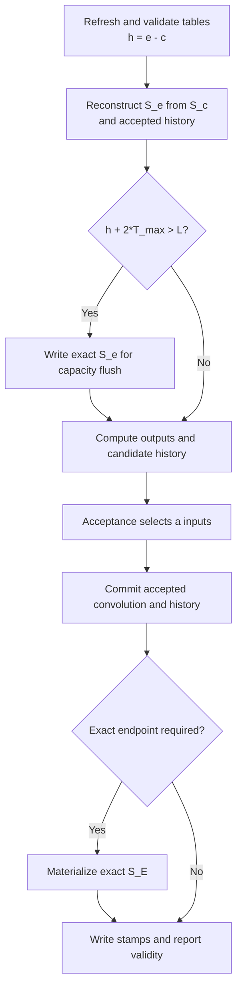

# Kimi-K3 Replay-SSM refactor — controlled-English edition

[Normative English design](kda-replay-ssm-design.md) |
[简体中文](kda-replay-ssm-design.zh-CN.md)

Status: proposal for design discussion.

This file is a simplified version of the normative English design. It uses
controlled-English rules that are inspired by ASD-STE100. It is not a certified
ASD-STE100 document. The normative English design has authority if the files
disagree.

## 1. Purpose

The current Kimi-K3 decode paths use two methods to maintain KDA state.

- Standard decode writes a complete recurrent state after each token.
- Speculative decode verifies a candidate window. It then replays the accepted
  inputs and writes a complete recurrent state.

The speculative path stores candidate intermediates in a workspace. This
workspace is valid for one decode round only. It is not a persistent history
cache.

The new design has two main goals:

1. Use one state protocol for standard decode and speculative decode.
2. Keep accepted K/U/D history in LCM, so later rounds of the same request can
   reuse it.

Standard decode uses the same protocol with `T=1`. Speculative decode uses the
protocol with `T>1`.

The design does not change the model weights or the acceptance rule.

## 2. Current implementation and target implementation

The current implementation has recurrent-state cache, convolution-state cache,
and a per-round speculative workspace. It does not have persistent accepted
K/U/D history.

| Item | Current implementation | Replay-SSM target |
| --- | --- | --- |
| State at round entry | The previous round wrote exact recurrent `S_e`. | Exact checkpoint `S_c` and accepted history `[c,e)` represent logical `S_e`. |
| Standard decode | Update and write the complete recurrent state for each token. | Use `T=1`. Add one accepted history entry. Materialize complete state only when required. |
| Speculative verify | Store current-window projections and intermediates in per-round workspace. | Produce candidate K/U/D history `[e,e+w)`. |
| Work after acceptance | Replay the accepted prefix. Write exact `S_e`. | Promote `[e,e+a)` to persistent history. Exclude rejected `[e+a,e+w)`. Do not run post-acceptance recurrent replay. |
| History lifetime | Candidate intermediates are valid for one round. | Accepted history is valid across rounds of the same live request. |
| History owner | The backend owns per-round workspace. | LCM owns persistent history. |
| Complete-state write | Standard decode writes each step. Speculative decode writes after replay. | Write at a capacity flush, an aligned reusable checkpoint, or another explicit snapshot boundary. |
| Reuse scope | Reuse is inside one verify/commit round. | Later rounds of the same request reuse accepted history. Other requests do not reuse it. |
| Decode protocol | Standard and speculative decode use different state-maintenance behavior. | Both modes use one prepare, reconstruct, forward, acceptance, and commit protocol. |

In this document, **history reuse** has one meaning. The accepted part of the
current candidate window becomes request-local history. A later round of the
same request reads this history.

History reuse does not mean cross-request prefix reuse. A prefix hit starts from
an exact checkpoint and empty history. A rejected suffix never becomes history.

## 3. Scope

The first target is Kimi-K3 on NVIDIA Blackwell.

- Activation type: BF16.
- Recurrent-state type: FP32.
- Head dimension: 128.
- Maximum input width: `T_max=1` or `T_max=4`.
- Validation weights: real NVFP4 weights.
- Tensor parallel size: TP8.

The following items are not in this replacement:

- Output-only attention.
- A change to sampling or acceptance rules.
- Live request transfer between prefill and decode workers.
- Buffered replay for other linear-attention models.
- Dynamic history capacity.
- Window-parallel KDA.

The repository has an opt-in ReplaySSM path for selected Qwen GDN models. This
design does not change that path. That path is not a reason to keep a
legacy/new selector for KDA. A later design can define common GDN and KDA
interfaces.

## 4. Upstream requirements

This design uses two related changes.

| Work | Status | Function |
| --- | --- | --- |
| [Upstream #1597](https://github.com/lightseekorg/tokenspeed/pull/1597) | Merged | Tracks the exact computed frontier and pending materialized boundaries. |
| [Fork #3](https://github.com/byshiue/tokenspeed/pull/3) | Under review | Adds bounded live-state retention with `max_state_lag_tokens`. |

During decode, `Request::NumComputedTokens()` is `TokenSize() - 1`. The last
sampled token is not included because the model did not process it as an input.

The scheduler must keep proof of a materialized boundary until admission and
publication succeed.

## 5. State model

For one request and one KDA layer, use these variables:

- `c`: position of the exact recurrent checkpoint.
- `e`: number of accepted and computed input tokens.
- `w`: width of the current candidate window. `w <= T_max`.
- `a`: number of accepted inputs in the current window.
- `L`: logical history capacity.
- `h`: accepted history length. `h = e - c`.

The state relation is:

```text
exact recurrent S_c + accepted history [c,e) = logical recurrent S_e
                      candidate history [e,e+w) is not committed
```

For each token, history stores these FP32 values:

- Normalized key `K`.
- Correction vector `U`.
- Per-key-channel multiplicative decay `D`.

The query is not persistent history. Rejected candidate data is not logical
state, even if its bytes remain in allocated memory.

The convolution window is exact at endpoint `e`. The recurrent checkpoint can
remain at `c`. The checkpoint and accepted history together represent the live
state.

Only a materialized exact checkpoint can be used for prefix reuse or transfer.

## 6. Ownership

| Owner | Required responsibility |
| --- | --- |
| LCM cache | Own persistent state and history fields. Allocate, protect, and reclaim their memory. |
| C++ scheduler | Own token demand, admission, retention, publication, recovery, and request lifecycle. |
| Runtime | Refresh fixed-address metadata. Order forward, acceptance, and commit. Report completion. |
| `tokenspeed-kernel` | Validate backing storage. Reconstruct state. Compute outputs and history. Write selected state, convolution windows, and stamps. |

The backend must not own a persistent per-request history ring. It can own
fixed-address batch metadata and reusable per-round scratch.

Do not use a pool-private tail such as the GLM-5.3-Flash KPool tail. Such a tail
is outside scheduler admission and cache-reclaim accounting. Replay history
controls state reconstruction. Therefore, LCM must own it.

## 7. LCM cache contract

### 7.1 Bounded checkpoint retention

`max_state_lag_tokens=d` tells the allocator how far a live checkpoint can lag
behind computed progress.

The value changes retention only. It does not change prefix identity or state
block size.

For state-block span `G` and progress `p`, a slot can expire only if its index is
less than:

```text
max(0, floor((p - d - 1) / G))
```

The checkpoint at endpoint `c` is in slot `floor((c-1)/G)`. Endpoint zero uses
the initial zero state.

Admission, victim selection, reservation, and reclaim must use the same rule.
The startup budget must add `ceil(d/G)` state blocks for each live request.

All Python and C++ interfaces must carry the same explicit lag value. Existing
recipes use zero lag.

### 7.2 Request-local history group

Do not add sliding retention to a state-family group. Main rejects that
combination, and this design keeps the restriction.

Add a separate row-backed `history` family. A sliding history group can name its
state dependency with `replay_checkpoint_group`.

P2 must update these items in one change:

- `cache-concepts.md`.
- `scheduler.md`.
- Python cache specifications.
- The C++ bridge and validation.

Use these initial relations:

```text
d = L - T_max
L >= 2 * T_max
history window > d
```

The history group has these rules:

- Use absolute token positions in the block table.
- Do not use positions modulo `L`.
- Keep history request-local.
- Do not publish, canonicalize, prefix-match, or write history to Host cache.
- Start a prefix hit with an exact checkpoint and empty history.
- Do not allocate history for the complete prefill prompt.
- Use sparse suffix demand for the last prefill chunk.
- Keep uninitialized rows distinct from valid empty history.
- Write payload or state before the position stamp.
- Do not use a missing stamp to recover lost live history.

An allocated hole is not an empty exact-state seed. Tests must include this
case.

### 7.3 Memory estimate

One FP32 history entry uses:

```text
4 * (2 * D_k + D_v) bytes per head
```

For `D_k=D_v=128`, one entry uses 1.5 KiB per head. A complete state uses
64 KiB per head. The history entry is approximately 43 times smaller.

For TP8 Kimi-K3, use 69 local KDA layers and 12 local heads.

- `L=8`: approximately 9.7 MiB per request per GPU for K/U/D payload.
- `L=16`: approximately 19.4 MiB per request per GPU.
- `L=16` and 256 live requests: approximately 4.85 GiB per GPU.

These values do not include retained checkpoint blocks, stamps, page rounding,
candidate protection, overlap protection, or runtime scratch.

## 8. Scheduler and lifecycle

The scheduler must keep one admission and forward path. It must not inspect
per-layer history. It must not reduce the verify width to fit backend storage.

The device determines the capacity-flush mask for each request.

Only a materialized exact endpoint can become a reusable checkpoint. These
events do not prove materialization:

- Crossing an aligned boundary.
- Allocating a block.
- Committing a convolution window.
- Planning a capacity flush.

The scheduler must publish before it reclaims the required storage. A failed
admission must not consume pending materialization evidence.

Lifecycle rules:

- **Prefill to decode:** Start from exact state and empty history.
- **Prefix hit:** Start from an exact prefix checkpoint and empty history.
- **Aligned accepted endpoint:** Materialize the actual endpoint before
  publication.
- **Retraction:** Restore an exact prefix checkpoint. Recompute the suffix. Do
  not export live history as exact state.
- **Finish or cancel:** Keep storage until all in-flight readers and writers
  finish.
- **Live handoff or P-D:** Reject this configuration until a separate design
  adds quiescent materialization and transfer.

GPU validity must use the normal forward-result path. CPU checks and rank
agreement must finish before scheduler feedback reports success.

## 9. Decode protocol

The runtime uses three operations.

| Operation | Input | Output or side effect |
| --- | --- | --- |
| Prepare | Current tables, accepted endpoints, valid widths, geometry, `L`, and `T_max`. | Checkpoint positions, history lengths, flush masks, and validity flags in fixed buffers. |
| Forward | Q/K/V and gate producers, checkpoint/history views, and prepared positions. | Verify output and candidate K/U/D. A capacity flush can write exact pre-candidate state. |
| Accepted commit | Accepted input counts, candidate data, endpoint masks, and current tables. | Accepted convolution window, selected exact recurrent endpoint, and ordered stamps. |

Standard and speculative decode use this flow:



`a` includes the target input. Do not add one more token. Standard decode uses
`a=1`. Padding uses `a=0` and must not change state.

A capacity flush writes old accepted endpoint `e`. It must not include candidate
tokens. An endpoint writer after acceptance can write new endpoint `E=e+a`.

Forward already reconstructed `S_e`. A capacity flush stores this state. It does
not run another recurrence.

Metadata and scratch addresses must remain fixed for CUDA graph capture. The
buffers must support the runtime maximum batch size, not only captured sizes.

## 10. Capacity-flush rule

Use this flush test:

```text
h + 2 * T_max > L
```

This rule reserves two windows:

1. Up to `T_max` accepted inputs from this round.
2. Up to `T_max` candidates for the next round.

If this round does not flush:

```text
h_next = h + a
a <= T_max
h_next + T_max <= L
```

Therefore, the safe no-flush condition is:

```text
h + 2 * T_max <= L
```

For `L=8` and `T_max=4`, any `h>0` causes a flush. This capacity is legal but
usually gives poor amortization. `L=16` allows history to persist for more
rounds.

The two-window rule is a buffer-lifecycle rule. It is not an SSM mathematical
requirement. Do not change it to a one-window rule without a separate design for
flush ordering, in-flight readers, reclaim, and admission.

## 11. Numerical contract

State reconstruction must keep ordered FP32 KDA updates. Algebraic equality is
not sufficient. A different operation order can change rounding, acceptance,
and output tokens.

Before phase two starts, maintainers must select one contract.

| Contract | Required criteria |
| --- | --- |
| Bitwise | Verify output, accepted recurrent/conv state, and deterministic acceptance sequence match bit for bit. |
| Tolerance | Define dtype-specific output/state `atol` and `rtol`. Define acceptance, AIME, and E2E limits before implementation. |

Do not lower the selected limits after kernel results are available. If the
implementation cannot meet the contract, return the change to design review.

The initial target is to preserve current verify output and accepted-state
behavior. Compare with an independent reference before kernel tuning.

Possible kernel optimizations include:

- Fuse compatible convolution and gate producers.
- Reuse reconstructed state.
- Change tile or reduction layout without violating the numerical contract.
- Batch metadata or selected-endpoint writes across layers when dependencies
  permit it.

Keep third-party and vendor kernels behind `tokenspeed-kernel`.

## 12. Expected benefit and cost

The expected benefits are:

- Remove post-acceptance recurrent replay.
- Reduce complete-state writes.
- Put accepted commit in the unified graph-stable decode lifecycle.

The ReplaySSM blog uses a different baseline. Its concurrency gains include the
removal of per-draft full-state snapshots. TokenSpeed Kimi-K3 does not have
those snapshots. Do not use the blog's concurrency numbers as an expectation
for this work.

The expected costs are:

- Persistent request-local history.
- Retained lagging checkpoints.
- History reads and reconstruction arithmetic.
- Metadata and commit work.
- Complete-state writes at flush and snapshot boundaries.

Output-only attention is not in scope. Each round still reads complete `S_c`.
Full-state read traffic does not decrease. Reconstruction cost grows with `h`.

Retraction cost also grows with state lag. The newest exact checkpoint can lag
by up to `d=L-T_max` tokens. Recovery can recompute up to `d` additional tokens
for each retracted request.

The final PR must test:

```text
L in {8, 16, 32} x target concurrency
```

Report these measurements:

- Latency.
- Throughput.
- GPU memory.
- Flush frequency.
- Retraction recovery cost.
- Acceptance.

Select the recipe default from these results. Do not select it from the legal
capacity bounds only.

## 13. Delivery plan

Delivery has two phases.

### 13.1 Phase one: behavior-preserving preparation

Phase one can use multiple PRs. Each PR must make the current implementation
use the new general interface. Do not add an unused Replay-SSM side path.

After each preparation PR, these properties must remain unchanged:

- Cache geometry.
- Memory use.
- Scheduler decisions.
- Kernel dispatch.
- Numerical output.
- Performance.

| PR | Change | Current implementation use | Verification |
| --- | --- | --- | --- |
| P1 | Make state lag, expiry, admission, reclaim, and startup budget cache-group properties. | Existing recipes pass zero lag. | Compare zero-lag block tables, admission, reclaim, and memory budget with main. Test nonzero-lag boundaries separately. |
| P2 | Add row-backed `history` family, dependencies, request-local policies, sparse demand, and absolute positions. | Existing KV/state groups use the generalized description. Do not create K/U/D history pages. | Compare existing recipe geometry and demand. Test allocation, protection, reclaim, and hole-versus-empty-seed behavior. |
| P3 | Add common fixed-address decode descriptors, state commit, validity, materialized endpoint, and rank completion feedback. | Current standard and speculative KDA use the descriptors and report exact per-round state. Keep current kernels. | Compare state, publication, cancellation, retraction, mixed batches, eager mode, graphs, and overlap. |

Phase one must not add these items:

- Replay-SSM kernels.
- K/U/D replay history instances.
- A legacy/Replay-SSM selector.
- A change to standard or speculative decode algorithms.

### 13.2 Phase two: one atomic replacement PR

Phase two uses one PR. The PR must add Replay-SSM and remove the old KDA state
maintenance implementation.

The final tree must contain one KDA decode protocol. It must not contain a
legacy/new environment variable, CLI option, or runtime branch.

The PR must complete all these items:

- Add the Kimi-K3 K/U/D/stamp history recipe.
- Add paged reconstruction and candidate-history kernels.
- Add capacity flush and accepted-only commit.
- Add exact-endpoint materialization.
- Use one runtime flow for standard and speculative decode.
- Use the common scheduler retention and publication protocol.
- Remove post-acceptance recurrent replay.
- Remove the separate standard-decode state-maintenance path.
- Pass correctness, AIME, lifecycle, capacity, concurrency, and E2E performance
  gates.

The PR can contain multiple commits. Development can use a separate worktree or
baseline binary for comparison. The final review diff must not keep two serving
implementations.

If correctness or performance is not ready, keep the PR in draft. Do not merge
a dual-path switch as a temporary solution.

## 14. Acceptance gates

The final replacement revision must pass these gates:

- Zero-lag cache and SWA regressions after #1597.
- Tight-pool admission and reclaim.
- Prefix hits.
- Cancellation and retraction.
- Multi-window recurrence and accepted-state reference tests.
- Sparse holes and invalid stamps.
- Eager mode and CUDA graph mode.
- Padding and mixed prefill/decode batches.
- Runtime overlap.
- Real Kimi-K3 NVFP4 weights with TP8.
- Full-model agentic workload.
- AIME.
- `L ∈ {8,16,32}` and target-concurrency sweep.
- E2E performance with no regression against the approved baseline.

Kernel-only timing does not replace full serving validation.

## 15. Future work

These items require separate designs after the KDA replacement:

- Live request handoff and P-D transfer.
- Output-only KDA.
- Window-parallel KDA.
- Dynamic history capacity.
- Replay-SSM for GDN, Qwen, or other linear-attention models.

The LCM interfaces can support future work. Do not add unapproved behavior to
the current replacement.

## References

- [Normative KDA Replay-SSM design](kda-replay-ssm-design.md).
- [Cache concepts](cache-concepts.md).
- [Scheduler](scheduler.md).
- [Unified execution path](unified_path.md).
- [Event loop](event-loop.md).
- [ReplaySSM blog](https://dao-lab.ai/blog/2026/replayssm/).
