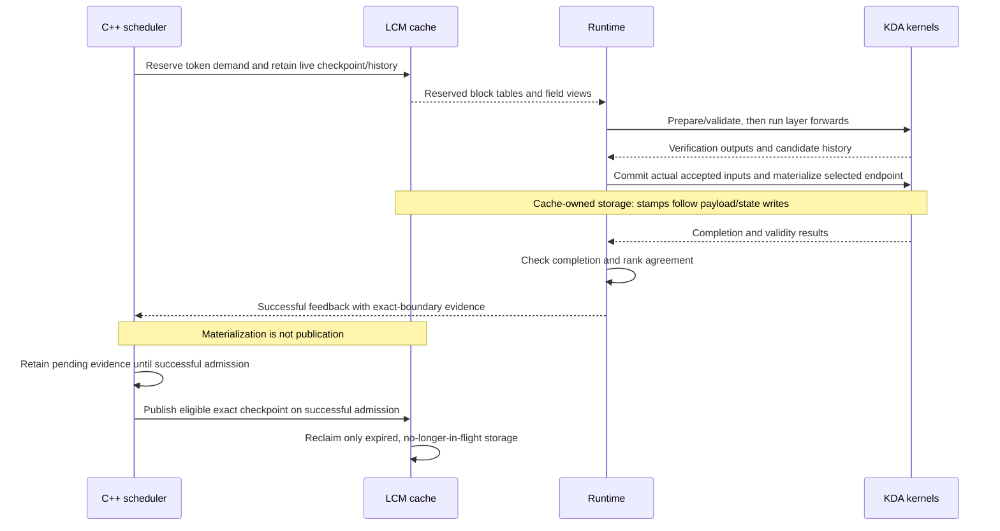
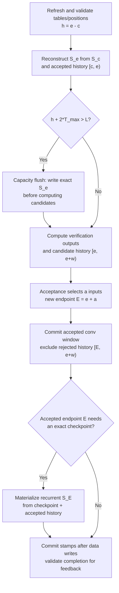

# Kimi-K3 Replay-SSM refactor

Status: design for cache/scheduler review. A default-off prototype exists on
`kda-buffered-replay`; its existence does not imply approval of the shared cache
contract or completion of performance validation. Agree on Sections 3–5 before
further implementation or upstream integration of those contracts.

## 1. Problem and scope

Kimi-K3's current speculative path verifies a candidate window, then replays the
accepted inputs to commit convolution and recurrent state. Ordinary decode also
writes the full recurrent state every step. Repeated replay and full-state
writes are expensive relative to the small number of accepted tokens.

The proposal keeps an exact recurrent checkpoint plus compact accepted history.
Forward reconstructs the current state, produces outputs and candidate history,
and acceptance commits only the accepted prefix. Full recurrent state is written
when capacity requires it or an exact snapshot is needed. This replaces routine
post-acceptance recurrent replay; it does not eliminate state reconstruction or
every endpoint write.

Ordinary decode (`T=1`) and speculative verification use the same protocol.
Prefill continues to consume and produce exact states. Initial support is Kimi-K3
on Blackwell with BF16 activations, FP32 recurrent state, head dimension 128 and
maximum verification width `T_max=1` or `4`. Real NVFP4 weights are part of the
validation setup, not a change to state precision.

Non-goals are output-only attention, changing sampling/acceptance rules, enabling
buffered replay for GDN/Qwen models, and transferring a live buffered request
between prefill/decode workers. Other models retain zero lag and existing behavior.

## 2. PR status and upstream baseline

| Work | Status | Scope |
| --- | --- | --- |
| [Upstream #1597](https://github.com/lightseekorg/tokenspeed/pull/1597) | **Merged**, merge commit `77eec209` | Fixes checkpoint publication against the exact computed frontier and preserves pending materialized boundaries. This prerequisite is already addressed; no duplicate fix is planned. |
| [Fork #3](https://github.com/byshiue/tokenspeed/pull/3) | **Open, under review; not merged**, head `77fbdf93` | Adds bounded live-state retention through `max_state_lag_tokens`, shared reclaim rules and matching capacity budgets. It does **not** add replay history, buffered kernels or serving enablement. |
| Remaining replay integration | Prototype, not yet accepted upstream | Request-local history, Kimi layout, kernels, runtime commit and experimental enablement described below. |

At this status check, fork #3 targets `cache-decode-checkpoint-publication`, while
its description names an older review base. Before merging, reconcile that base
and description with upstream main containing #1597, then rerun the affected
tests. The prototype results below are not results for a rebased #3.

Use #1597's `Request::NumComputedTokens()` as the frontier: during decode this is
`TokenSize() - 1`, excluding the last sampled token. Retain all known materialized
boundaries until successful admission publishes them. Older experimental notes
using `TokenSize() - decode_width` or a single pending watermark are historical,
not the contract proposed here.

## 3. State representation and ownership

For each request and KDA layer, let `e` be the number of accepted inputs already
consumed, `c` the recurrent checkpoint position, and `w <= T_max` the current
candidate width:

```text
exact recurrent S_c + accepted history [c, e) = logical recurrent S_e
                      candidate history [e, e+w) is not committed yet
```

History stores FP32 normalized key `K`, correction vector `U`, and multiplicative
decay `D` per token. KDA decay is per key channel, not a scalar. Queries are needed
for current outputs but are not retained. Rejected candidates never become part
of the logical state, even if their bytes remain allocated.

The small convolution window stays at accepted endpoint `e`; recurrent state may
remain at `c`. That combination is valid only with the accepted history. It is
**not** an exact snapshot for prefix reuse or transfer until recurrent state has
also been materialized at the advertised endpoint.

| Owner | Responsibility |
| --- | --- |
| LCM cache | Persistent state/history fields, allocation, exclusive writable ownership, prefix snapshot immutability, in-flight fences and reclamation. |
| C++ scheduler | Token-level demand, retention and admission, exact checkpoint publication, request lifecycle and recovery. No recurrence computation. |
| Runtime | Refresh graph-stable metadata, order forward/acceptance/commit, validate completion and report successful materialization. |
| `tokenspeed-kernel` | Validate device backing, reconstruct state, compute outputs/history, and write selected states/windows/stamps into caller-owned storage. No allocation or publication authority. |

There is no backend-private persistent request ring. Backend-owned storage is
limited to fixed-address batch metadata and reusable per-round scratch.

## 4. Cache management contract

### Bounded checkpoint retention — fork #3

`max_state_lag_tokens=d` tells the allocator how far behind computed progress a
live consumer may still read. It changes retention, not prefix identity or state
block granularity. For state span `G` and progress `p`, slots below
`max(0, floor((p-d-1)/G))` may expire: a state at endpoint `c` occupies slot
`floor((c-1)/G)`. Endpoint zero uses the initial zero state.

Admission reclaim credit, victim planning, reservation and actual reclamation
must share this calculation. Otherwise admission can promise memory that a live
checkpoint still needs. Startup budgets add `ceil(d/G)` state blocks per live
request to the existing working set, including prefill input/checkpoint/tail and
overlap protection. Lag is not a replacement for those allowances.

The Python cache spec, bridge, C++ config and serialized contract carry the same
explicit value. Existing recipes use zero. Runtime and scheduler bindings must
be rebuilt together; missing contract fields must not silently assume a value.

### Request-local history — subsequent work

Add a sliding history group whose `replay_checkpoint_group` names its state
group. For logical capacity `L`, the prototype declares history window `L` and
state lag `d=L-T_max`, with `L >= 2*T_max`. Validate the dependency and require
the history window to exceed the declared lag.

The history group follows these rules:

- Block tables use absolute token positions, not modulo-`L` indices. Physical
  packing is separate: the prototype uses eight history rows per block.
- History is private to the live request. It is excluded from prefix publication,
  canonicalization and host writeback. A prefix hit starts from an exact state
  snapshot with empty history, not another request's live history.
- Long prefill does not allocate history for every prompt token. Intermediate
  chunks advance absolute tables with holes; the completing chunk reserves the
  suffix needed for the next decode window. Allocated rows before that endpoint
  are not initialized history. Ordinary sliding attention is unchanged.
- Cache-owned position stamps associate accepted history with its checkpoint.
  Stamp updates follow payload/state stores. Missing history cannot be recovered
  by treating a missing stamp as an empty buffer; empty seeding requires an exact
  state and freshly initialized storage.
- Retained history, candidates, overlap and partial-block rounding all count
  toward physical allocation. Python startup sizing and C++ admission must use
  matching bounds. Recheck those bounds against #1597's exact frontier rather
  than carrying forward the old `decode_width-1` guard unexamined.

For scale, FP32 history costs `4*(2*D_k+D_v)` bytes per head/token. With TP8,
69 local KDA layers, 12 local heads and `D_k=D_v=128`, `L=8` needs about
**9.7 MiB per live request per GPU** in logical K/U/D payload. This is not the
total memory increase: add retained state blocks, stamps, page packing,
overlap/candidate protection and runtime scratch. Larger `L` also increases
reconstruction work; it is not automatically faster.

## 5. Scheduler and lifecycle changes

The scheduler retains one admission/forward path. It schedules logical tokens
and cache demands; it does not inspect per-layer history or shorten a verify
window to fit a backend buffer. Flush decisions remain per-request device data.

Beyond bounded retention, integration needs sparse prefill history demand and
the history reuse restrictions above. Publication builds on #1597: record an
aligned boundary only after that exact accepted endpoint was materialized.
Crossing a boundary, allocating a block, committing convolution, or planning a
capacity flush does not establish an exact reusable snapshot. Failed admission
must not consume pending materialization evidence; publish before reclaiming.

Lifecycle requirements are:

- **Prefill → decode / prefix hit:** start from an exact checkpoint and empty
  history. Agentic continuations currently arrive as new requests using prefix
  matching, not live `Decoding → Prefilling` transitions.
- **Accepted boundary:** selectively materialize the actual aligned accepted
  endpoint before reporting it as reusable; do not invent every crossed state.
- **Retraction:** retain existing exact-prefix checkpoint recovery and suffix
  recomputation. Do not export live history as an exact state.
- **Finish/cancel:** no final full-state write is required unless a snapshot is
  being published. Preserve in-flight ownership until all readers/writers finish.
- **Direct live handoff / P-D transfer:** require quiescent endpoint
  materialization using fresh tables before admission reshapes or reclaims them.
  A kernel primitive exists, but scheduler handoff integration remains gated;
  reject these configurations in the first serving integration.

GPU validation flags travel through the normal forward-result path. CPU/rank
agreement must complete before successful scheduler feedback. An invalid backing
or missing required result is a cache invariant failure, not a silent fallback.
The event loop does not launch GPU work or inspect device history.

### From allocation to a reusable checkpoint

This sequence follows a round that materializes an aligned accepted endpoint.
It shows ownership and ordering, not a new synchronization barrier per round.
Overlapped execution must preserve the same dependencies.



Only the exact checkpoint becomes reusable; live history remains request-local.
Failed validation sends no successful feedback. Failed admission retains the
pending evidence for a later attempt.

## 6. KDA kernel and runtime interface

The prototype's recurrence entry is `triton_kda_buffered_recurrent`; runtime
orchestration uses `KDAReplayMetadata` and `KDAReplayWorkspace`. Keep the following
contract even if the backend implementation changes:

| Phase | Inputs | Outputs / side effects |
| --- | --- | --- |
| Prepare and validate, once per group | Current raw tables, accepted endpoints, valid widths, pool geometry, `L`, `T_max` | Checkpoint positions, history lengths, flush masks and backing-validity flags in fixed buffers. |
| Forward, per layer | Q/K/V and gate producers, checkpoint/history views with explicit strides, prepared positions | Verification outputs and candidate K/U/D; optionally an exact pre-candidate checkpoint. |
| Accepted commit, after layer forwards | Actual accepted input counts, candidate payload, endpoint masks and current tables | Accepted convolution window, selected exact recurrent endpoints and ordered position stamps. |
| Quiescent materialization | Fresh request tables and accepted endpoints | Exact endpoint states and completion validity, without consuming candidates or requiring space for another window. |

### One decode round

The flow below is for a valid, active request. Both ordinary and speculative
decode follow it; the width and accepted count differ. Diamonds represent
per-request device masks, not CPU branches or separate CUDA graphs.



The forward/reconstruction work runs per layer; acceptance and the selected
endpoint commit follow the layer forwards. `a` includes the target input, not
just draft matches; do not add another token. Ordinary decode has `a=1`;
padding has `a=0` and no mutations. Rejected bytes need not be erased: the
committed endpoint excludes them.

Capacity flush writes the **old accepted endpoint `e`**, never candidates. The
post-acceptance writer instead materializes the **new endpoint `E`** when needed
for an exact aligned snapshot. That snapshot still requires the publication
sequence above. If no endpoint write is needed, checkpoint plus accepted history
continues to represent the current state.

The conservative two-window rule is an initial policy: for `L=8,T_max=4`,
nonempty history can trigger a flush on the next round, so capacity eight does
not imply one state write per eight accepted tokens.

All destinations must be writable and validated before stores. Commit stamps
only after the corresponding data are ready. Mixed flush/no-flush requests,
partial acceptance and padding use the same eager/CUDA-graph sequence. Metadata
and scratch have stable addresses and cover the runtime batch bound, not just
the graph capture sizes. Mixed prefill/decode batches keep exact-state prefill
and use the same commit protocol for their decode suffix.

Capacity is startup-fixed and explicitly selected through
`--ssm-replay-buffer-capacity`; omission keeps existing execution. The prototype
accepts `2*T_max <= L <= 64` within its supported hardware/layout range and
rejects invalid or unsupported configurations. No default capacity is proposed.

## 7. Numerical contract and optimization approach

State reconstruction must preserve the ordered FP32 KDA updates. Algebraic
equivalence alone is insufficient: changed rounding can alter verify outputs,
acceptance length and end-to-end performance.

The current prototype distinguishes BF16 verification producers from FP32
accepted-history producers. Two register-local recurrence chains share one
history reconstruction. Buffered and unbuffered verification use explicit shared
reduction/update arithmetic. This avoids depending on one legacy compiler's
incidental instruction ordering, but **does change some last bits relative to
the frozen original**. Review that arithmetic change explicitly; do not present
new-pair equality as bitwise equality with the original implementation.

Implemented prototype optimizations include combined conv/gate producer
launches where precision permits, interleaving the two recurrence chains,
explicit reduction layouts, and batched selected-endpoint writes across layers.
Small-row cases retain separate producer work when fusion changes rounding.
Capacity flush remains inside per-layer forward, not a cross-layer flush phase.

Next optimize from full-path profiles: metadata/commit launch cost, stream
overlap, B1/B2/B4 execution and observed history lengths. Tune capacity, tiling
and producer fusion while preserving the numerical contract. Output-only
algebra, reassociated tensor-core reconstruction or moving flush across layers
need separate correctness/performance evidence; they are not prerequisites for
agreeing on cache ownership. A future CuteDSL backend should consume the same
contract through `tokenspeed-kernel`, without runtime-side vendor dependencies.

## 8. Expected benefit and current evidence

The intended benefit is less full-state write traffic and less post-acceptance
replay. The cost is persistent history, reconstruction reads/arithmetic,
metadata/commit work and occasional exact-endpoint writes. A full state has
`D_k*D_v` elements per head; one history entry has `2*D_k+D_v`. This motivates
the design: at dimension 128, these are 64 KiB and 1.5 KiB in FP32, respectively.
It is not an end-to-end speedup estimate.

The latest completed comparison uses prototype **`b60c8f0a`**, not the later
`42caaa26` layout fix, fork #3 alone, or an integration rebased onto #1597.
The frozen original is `2e4b5407`; the current unbuffered control uses the same
shared-arithmetic commit as buffered execution. `B` denotes executing batch size
and `C` client concurrency:

| Measurement | Result | Interpretation |
| --- | --- | --- |
| KDA-only, CUDA-graph two-window cycle, 69 layers, `L8/B4/T4` | Original 2.095–2.108 ms; optimized buffered 2.094–2.102 ms | Approximately parity. Includes producers and accepted commit, but not full runtime stream overlap. |
| Full-model whole-batch latency, `L8/C4` | Original 1611.950–1622.081 ms; current unbuffered 1631.551–1644.842 ms; buffered 1663.791–1673.887 ms | Buffered is **3.205% slower than original**, **1.871% slower than same-commit unbuffered**, using equally weighted startup medians. |
| Current buffered vs current unbuffered | Matching token/rounded-acceptance multisets for all 120 measured buffered requests | Supports this fixed workload, not general model accuracy. |
| Original vs current | Acceptance rate 88.98% vs 88.12%; generated tokens differ | The arithmetic change still needs a separate quality assessment. |

E2E environment: real 93-layer Kimi-K3 NVFP4, TP8 on eight GB300 GPUs, BF16
activations, FP8 KV cache, CUDA 13, PyTorch 2.13 and FlashInfer 0.6.18. EAGLE3
uses width four; decode CUDA graphs, segmented prefill graphs and runtime
overlap are enabled.

The fixed continuation comes from `SWE-bench/SWE-smith-trajectories`, revision
`08e109b4a59eaeebf80e4675cd125d42e7ac99a4`, instance
`pandas-dev__pandas.95280573.pr_59144`: 51,936 input tokens, 51,328 cached,
256 output tokens, temperature zero and seed one. Three arms each have two
fresh startups and 15 measured C4 batches per startup: 360 measured requests
total. Table ranges are startup-median ranges, not confidence intervals.

Kernel/runtime regressions and saved real-input comparisons also pass for that
snapshot; see [M70/M71 in the progress record](kda-buffered-replay-progress.md#m70-recover-shared-buffered-kda-performance).
There is **no current-snapshot AIME result**. The E2E non-regression target remains
unmet; neither default enablement nor an E2E performance gain is claimed.

## 9. Review decisions and delivery gates

Before proceeding, cache/scheduler maintainers should agree on:

1. Bounded lag semantics, the shared expiry rule, and admission/startup budgets
   under #1597's exact frontier.
2. Request-local history as an LCM-owned group, its checkpoint dependency, sparse
   prefill demand and exclusion from prefix reuse/host writeback.
3. Publication evidence and completion ordering: what proves an exact state,
   how failed admissions retain evidence, and how overlap protects live storage.
4. Lifecycle boundaries: exact-state recovery, cancellation fences and keeping
   direct live handoff/P-D transfer gated until owner-level integration exists.

Then review in independently testable stages: finish bounded retention in #3;
add history ownership and layout/budgets; review kernels and their numerical
contract; integrate unified runtime commit with explicit, default-off enablement.
Keep the Python/C++ contract changes together rather than merging mismatched
interfaces. Shared design docs must be updated with each accepted contract.

Required gates are zero-lag/cache/SWA regressions after #1597; tight-pool,
overlap, prefix-hit and cancellation tests; independent multi-window recurrence
and accepted-state checks; eager/graph, padding and mixed-batch coverage; and
fresh three-arm E2E comparisons on the integration commit. Measure latency,
throughput, memory and acceptance with matched workloads and independent
startups. The performance target is no E2E regression against the original;
the same-commit unbuffered arm isolates the cost of buffering from the arithmetic
change. Run AIME on that same revision before a model-quality claim. Passing
kernel tests or KDA-only timing does not substitute for these serving gates.

## References

- [Cache concepts](cache-concepts.md), [scheduler](scheduler.md),
  [unified execution](unified_path.md), [event loop](event-loop.md).
- [Detailed implementation plan](kda-buffered-replay-plan.md) and
  [experiment/progress record](kda-buffered-replay-progress.md).
- Prototype entry points:
  [buffered KDA kernel](../../tokenspeed-kernel/python/tokenspeed_kernel/ops/attention/kda/_triton/buffered.py),
  [runtime workspace](../../python/tokenspeed/runtime/layers/attention/backends/state/kda_buffered.py).
