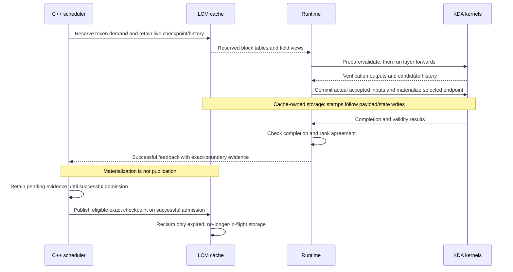
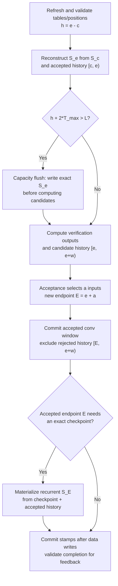

# Kimi-K3 Replay-SSM refactor

English | [简体中文](kda-replay-ssm-design.zh-CN.md)

Status: proposal for design discussion. The goal is to agree on the rationale,
ownership and scope of the cache, scheduler and KDA changes before deciding the
implementation plan. Sections 3–5 describe the proposed shared contracts;
Section 9 lists the decisions that need maintainer agreement.

## 1. Problem and scope

Kimi-K3's current speculative path verifies a candidate window, then replays the
accepted inputs to commit convolution and recurrent state. Ordinary decode also
writes the full recurrent state every step. Repeated replay and full-state
writes are expensive relative to the small number of accepted tokens.

The proposal keeps an exact recurrent checkpoint plus compact accepted history.
Forward reconstructs the current state, produces outputs and candidate history,
and acceptance commits only the accepted prefix. Full recurrent state is written
when capacity requires it or an exact snapshot is needed. This replaces routine
post-acceptance recurrent replay; it does not eliminate state reconstruction or
every endpoint write.

Ordinary decode (`T=1`) and speculative verification use the same protocol.
Prefill continues to consume and produce exact states. The proposed initial
scope is Kimi-K3 on Blackwell with BF16 activations, FP32 recurrent state, head
dimension 128 and maximum verification width `T_max=1` or `4`. Validation should
use real NVFP4 weights with TP8; weight precision does not change state precision.

Non-goals are output-only attention, changing sampling/acceptance rules, enabling
buffered replay for GDN/Qwen models, and transferring a live buffered request
between prefill/decode workers. Other models retain zero lag and existing behavior.

## 2. Upstream prerequisites and related PRs

| Work | Status | Scope |
| --- | --- | --- |
| [Upstream #1597](https://github.com/lightseekorg/tokenspeed/pull/1597) | Merged | Provides the exact computed frontier and pending materialized-boundary tracking. Reuse this foundation rather than duplicate the fix. |
| [Fork #3](https://github.com/byshiue/tokenspeed/pull/3) | Open, under review | Proposes bounded live-state retention through `max_state_lag_tokens`, shared reclaim rules and capacity budgets. Replay history, kernels and serving integration remain outside that PR. |

These PRs provide context for the shared contracts below; they do not settle
the scope of the remaining replay refactor.

Use #1597's `Request::NumComputedTokens()` as the frontier: during decode this is
`TokenSize() - 1`, excluding the last sampled token. Retain all known materialized
boundaries until successful admission publishes them.

## 3. State representation and ownership

For each request and KDA layer, let `e` be the number of accepted inputs already
consumed, `c` the recurrent checkpoint position, and `w <= T_max` the current
candidate width:

```text
exact recurrent S_c + accepted history [c, e) = logical recurrent S_e
                      candidate history [e, e+w) is not committed yet
```

The proposed history stores FP32 normalized key `K`, correction vector `U`, and
multiplicative decay `D` per token. KDA decay is per key channel, not a scalar.
Queries are needed for current outputs but are not retained. Rejected candidates
never become part of the logical state, even if their bytes remain allocated.

The small convolution window stays at accepted endpoint `e`; recurrent state may
remain at `c`. That combination is valid only with the accepted history. It is
**not** an exact snapshot for prefix reuse or transfer until recurrent state has
also been materialized at the advertised endpoint.

| Owner | Responsibility |
| --- | --- |
| LCM cache | Persistent state/history fields, allocation, exclusive writable ownership, prefix snapshot immutability, in-flight fences and reclamation. |
| C++ scheduler | Token-level demand, retention and admission, exact checkpoint publication, request lifecycle and recovery. No recurrence computation. |
| Runtime | Refresh graph-stable metadata, order forward/acceptance/commit, validate completion and report successful materialization. |
| `tokenspeed-kernel` | Validate device backing, reconstruct state, compute outputs/history, and write selected states/windows/stamps into caller-owned storage. No allocation or publication authority. |

There is no backend-private persistent request ring. Backend-owned storage is
limited to fixed-address batch metadata and reusable per-round scratch.

## 4. Cache management contract

### Bounded checkpoint retention — fork #3

`max_state_lag_tokens=d` tells the allocator how far behind computed progress a
live consumer may still read. It changes retention, not prefix identity or state
block granularity. For state span `G` and progress `p`, slots below
`max(0, floor((p-d-1)/G))` may expire: a state at endpoint `c` occupies slot
`floor((c-1)/G)`. Endpoint zero uses the initial zero state.

Admission reclaim credit, victim planning, reservation and actual reclamation
must share this calculation. Otherwise admission can promise memory that a live
checkpoint still needs. Startup budgets add `ceil(d/G)` state blocks per live
request to the existing working set, including prefill input/checkpoint/tail and
overlap protection. Lag is not a replacement for those allowances.

The Python cache spec, bridge, C++ config and serialized contract carry the same
explicit value. Unaffected recipes keep zero lag. Runtime and scheduler bindings
must be rebuilt together; missing contract fields must not silently assume a value.

### Request-local history — generic LCM extension and final replacement

Add a sliding history group whose `replay_checkpoint_group` names its state
group. The proposed initial policy uses history window `L` and state lag
`d=L-T_max`, with `L >= 2*T_max`. Validate the dependency and require
the history window to exceed the declared lag.

The history group follows these rules:

- Block tables use absolute token positions, not modulo-`L` indices. The number
  of history rows packed into a physical block is a separate layout decision.
- History is private to the live request. It is excluded from prefix publication,
  canonicalization and host writeback. A prefix hit starts from an exact state
  snapshot with empty history, not another request's live history.
- Long prefill does not allocate history for every prompt token. Intermediate
  chunks advance absolute tables with holes; the completing chunk reserves the
  suffix needed for the next decode window. Allocated rows before that endpoint
  are not initialized history. Ordinary sliding attention is unchanged.
- Cache-owned position stamps associate accepted history with its checkpoint.
  Stamp updates follow payload/state stores. Missing history cannot be recovered
  by treating a missing stamp as an empty buffer; empty seeding requires an exact
  state and freshly initialized storage.
- Retained history, candidates, overlap and partial-block rounding all count
  toward physical allocation. Python startup sizing and C++ admission must use
  matching bounds derived from #1597's exact frontier and the in-flight
  reservation horizon.

For scale, FP32 history costs `4*(2*D_k+D_v)` bytes per head/token. With TP8,
69 local KDA layers, 12 local heads and `D_k=D_v=128`, `L=8` needs about
**9.7 MiB per live request per GPU** in logical K/U/D payload. This is an
analytical estimate, not a measurement of total memory use: add retained state
blocks, stamps, page packing, overlap/candidate protection and runtime scratch.
Larger `L` also increases reconstruction work; it is not automatically faster.

## 5. Scheduler and lifecycle changes

The scheduler retains one admission/forward path. It schedules logical tokens
and cache demands; it does not inspect per-layer history or shorten a verify
window to fit a backend buffer. Flush decisions remain per-request device data.

Beyond bounded retention, integration needs sparse prefill history demand and
the history reuse restrictions above. Publication builds on #1597: record an
aligned boundary only after that exact accepted endpoint was materialized.
Crossing a boundary, allocating a block, committing convolution, or planning a
capacity flush does not establish an exact reusable snapshot. Failed admission
must not consume pending materialization evidence; publish before reclaiming.

Lifecycle requirements are:

- **Prefill → decode / prefix hit:** start from an exact checkpoint and empty
  history. Agentic continuations currently arrive as new requests using prefix
  matching, not live `Decoding → Prefilling` transitions.
- **Accepted boundary:** selectively materialize the actual aligned accepted
  endpoint before reporting it as reusable; do not invent every crossed state.
- **Retraction:** retain existing exact-prefix checkpoint recovery and suffix
  recomputation. Do not export live history as an exact state.
- **Finish/cancel:** no final full-state write is required unless a snapshot is
  being published. Preserve in-flight ownership until all readers/writers finish.
- **Direct live handoff / P-D transfer:** require quiescent endpoint
  materialization using fresh tables before admission reshapes or reclaims them.
  Keep these configurations outside the replacement PR. A future
  handoff requires scheduler/lifecycle integration as well as a materialization
  kernel.

GPU validation flags travel through the normal forward-result path. CPU/rank
agreement must complete before successful scheduler feedback. An invalid backing
or missing required result is a cache invariant failure, not a silent fallback.
The event loop does not launch GPU work or inspect device history.

### From allocation to a reusable checkpoint

This sequence follows a round that materializes an aligned accepted endpoint.
It shows ownership and ordering, not a new synchronization barrier per round.
Overlapped execution must preserve the same dependencies.



Only the exact checkpoint becomes reusable; live history remains request-local.
Failed validation sends no successful feedback. Failed admission retains the
pending evidence for a later attempt.

## 6. KDA kernel and runtime interface

The interface should separate per-group metadata preparation, per-layer forward
and accepted commit, with kernels exposed through `tokenspeed-kernel`. The table
defines responsibilities and data flow; API names and physical layouts are
implementation choices to review after agreeing on this contract.

| Phase | Inputs | Outputs / side effects |
| --- | --- | --- |
| Prepare and validate, once per group | Current raw tables, accepted endpoints, valid widths, pool geometry, `L`, `T_max` | Checkpoint positions, history lengths, flush masks and backing-validity flags in fixed buffers. |
| Forward, per layer | Q/K/V and gate producers, checkpoint/history views with explicit strides, prepared positions | Verification outputs and candidate K/U/D; optionally an exact pre-candidate checkpoint. |
| Accepted commit, after layer forwards | Actual accepted input counts, candidate payload, endpoint masks and current tables | Accepted convolution window, selected exact recurrent endpoints and ordered position stamps. |
| Quiescent materialization, for a future live handoff | Fresh request tables and accepted endpoints | Exact endpoint states and completion validity, without consuming candidates or requiring space for another window. Future extension; live handoff is outside the replacement PR. |

### One decode round

The flow below is for a valid, active request. Both ordinary and speculative
decode follow it; the width and accepted count differ. Diamonds represent
per-request device masks, not CPU branches or separate CUDA graphs.



The forward/reconstruction work runs per layer; acceptance and the selected
endpoint commit follow the layer forwards. `a` includes the target input, not
just draft matches; do not add another token. Ordinary decode has `a=1`;
padding has `a=0` and no mutations. Rejected bytes need not be erased: the
committed endpoint excludes them.

Capacity flush writes the **old accepted endpoint `e`**, never candidates. The
post-acceptance writer instead materializes the **new endpoint `E`** when needed
for an exact aligned snapshot. That snapshot still requires the publication
sequence above. If no endpoint write is needed, checkpoint plus accepted history
continues to represent the current state.

All destinations must be writable and validated before stores. Commit stamps
only after the corresponding data are ready. Mixed flush/no-flush requests,
partial acceptance and padding use the same eager/CUDA-graph sequence. Metadata
and scratch have stable addresses and cover the runtime batch bound, not just
the graph capture sizes. Mixed prefill/decode batches keep exact-state prefill
and use the same commit protocol for their decode suffix.

Keep capacity fixed at startup and require `L >= 2*T_max`. The final option
name, supported upper limit and recipe default remain review decisions.
Capacity tunes Replay-SSM's resource/performance tradeoff; it must not select a
legacy KDA implementation. After replacement, reject unsupported hardware,
layout or capacity combinations at startup.

### Why flush one window early?

The initial policy follows [ReplaySSM Section 5.3](https://dao-lab.ai/blog/2026/replayssm/#53-speculative-decoding):
flush when `h + 2*T_max > L`. Its [public GDN implementation](https://github.com/Johnny-Liou/ReplaySSM/blob/a84849410ab56cc2b23432969eb2ecfc42a13d9c/vllm/model_executor/layers/fla/ops/gdn_replayssm_spec_decode.py#L382)
uses the same test to prepare the next round's flush flag. Here `h=e-c` is
accepted history at round entry, `L` covers history and candidates, and `T_max`
is the configured maximum input width, not the actual accepted count.

Flush is part of the layer forward, not a separate stage that releases history
storage before admitting the candidate window. Even a flush round must enter
with room for a full window: `h + T_max <= L`. Writing `S_e` alone does not
authorize reuse of history that other in-flight readers still need.

If this round does not flush, it can accept up to `T_max` inputs. The next round
must still have room for its candidates, including when that round flushes:

```text
Next history length:          h_next = h + a, where a <= T_max
Required next-round capacity: h_next + T_max <= L
Safe not to flush this round: h + 2*T_max <= L
```

The two windows budget this round's possible accepted inputs and the next
round's candidates; they do not mean two rounds execute concurrently. This
also preserves the declared state-lag bound `d=L-T_max`. After a capacity
flush, the checkpoint advances to `e` and the new history contains only this
round's accepted inputs, so `h_next=a <= T_max <= L-T_max`. A separate exact
endpoint write can reduce the lag further.

For `L=8,T_max=4`, the flush test reduces to `h>0`. Starting with empty history,
and ignoring additional exact-endpoint writes:

| Round | History at entry `h` | Capacity flush? | Accepted inputs `a` | History after commit |
| --- | --- | --- | --- | --- |
| 1 | 0 | No | 2 | 2 |
| 2 | 2 | Yes | 1 | 1 |
| 3 | 1 | Yes | 3 | 3 |
| 4 | 3 | Yes | 3 | 3 |

Flushing every round after the first is expected here, but it loses the benefit
of amortizing full-state writes across rounds. `L=8` is the legal minimum for
`T_max=4`, not a recommended performance setting. With `L=16,T_max=4`, capacity
flush instead triggers at `h>8`, allowing history to span multiple rounds.
Larger buffers also cost memory and reconstruction work, so capacity needs
measurement rather than a larger-is-better assumption.

The two-window rule is a buffer-lifetime policy, not an SSM mathematical
requirement or a consequence of parallel verification. Serial recurrence alone
does not relax it. A one-window condition such as `h+w>L` would need a protocol
that finishes flush and safely releases old history before reusing its space
for candidates. That requires reviewing execution ordering, in-flight readers,
entry validation and LCM retention/admission bounds together; changing only
`2*T_max` to `T_max` would violate the current `h<=L-T_max` entry contract.
Keep that alternative a separate design decision.

## 7. Numerical contract and optimization approach

State reconstruction must preserve the ordered FP32 KDA updates. Algebraic
equivalence alone is insufficient: changed rounding can alter verify outputs,
acceptance length and end-to-end performance.

The initial numerical target is to preserve the existing verification outputs
and accepted-state updates. Compare against an independent reference for the
current implementation, including convolution and gate producer precision,
before tuning kernels.

One candidate keeps BF16 verification producers and FP32 accepted-history
producers separate, with two register-local recurrence chains sharing one
history reconstruction. Another choice is explicit verification arithmetic for
Replay-SSM. It may round differently from the current path. It may be explored
on the replacement branch, but cannot merge as a preparation PR because
preparation must preserve current numerics. The replacement must pass the
agreed numerical, acceptance, AIME and performance gates; do not redefine the
baseline or relax tolerances merely to obtain equality.

Potential optimizations, subject to that contract, include:

- Fuse compatible conv/gate producers to reduce launches without changing the
  required precision or rounding.
- Reuse reconstructed state, interleave independent work and tune reduction
  layouts to reduce recurrence overhead.
- Batch shared metadata and selected-endpoint writes across layers where
  dependencies allow it.

The baseline proposal keeps capacity flush inside per-layer forward. Moving it
across layers changes execution ordering and needs separate review. Output-only
algebra and reassociated tensor-core reconstruction are also separate proposals,
not prerequisites for agreeing on cache ownership. Backend selection, including
CuteDSL, must stay behind `tokenspeed-kernel`; runtime should not gain direct
vendor dependencies.

## 8. Expected benefit and tradeoffs

The intended benefit is less full-state write traffic and less post-acceptance
replay. The cost is persistent history, reconstruction reads/arithmetic,
metadata/commit work and occasional exact-endpoint writes. A full state has
`D_k*D_v` elements per head; one history entry has `2*D_k+D_v`. This motivates
the design: at dimension 128, these are 64 KiB and 1.5 KiB in FP32, respectively.
It is not an end-to-end speedup estimate.

The tradeoff depends on acceptance length, flush frequency, history length and
concurrency. Larger buffers may reduce writes but increase reconstruction work
and reserved memory. Extra metadata/commit launches can offset kernel savings.
These are hypotheses to evaluate, not promised performance gains. Merge the
replacement only after the agreed correctness and E2E performance criteria
pass; a permanent legacy/new implementation switch is not a substitute for
acceptance.

## 9. Review decisions and delivery gates

Before proceeding, cache, scheduler and KDA maintainers should agree whether
reduced full-state writes/replay justify the extra storage and reconstruction
work for the target workload. Then settle:

1. Bounded lag semantics, the shared expiry rule, and admission/startup budgets
   under #1597's exact frontier.
2. Request-local history as an LCM-owned group, its checkpoint dependency, sparse
   prefill demand and exclusion from prefix reuse/host writeback.
3. Publication evidence and completion ordering: what proves an exact state,
   how failed admissions retain evidence, and how overlap protects live storage.
4. Lifecycle boundaries: exact-state recovery, cancellation fences and keeping
   direct live handoff/P-D transfer gated until owner-level integration exists.
5. Numerical scope: the required relationship to current outputs/state,
   whether shared arithmetic belongs in this refactor, and acceptance/quality
   criteria agreed before implementation.
6. Initial scope: supported shapes and capacities, public API boundaries, and
   which kernel optimizations should remain separate follow-up work.

### 9.1 Two-stage delivery plan

Delivery has two phases: preparation may contain several small PRs; the final
change is one replacement PR. The boundary is not the number of files or
components, but whether main would contain two KDA decode semantics at once.

#### Phase one: preparation—extend existing modules without changing behavior

Each preparation PR must migrate the current implementation onto the generalized
interface; it must not merely add an unused Replay-SSM side path. After every PR,
standard and speculative decode still run the current KDA algorithm. Cache
geometry, memory use, scheduler decisions, kernel dispatch, numerics and
performance should remain unchanged. General interfaces describe current
behavior with explicit arguments rather than silent defaults.

The proposed PRs are below. Adjacent items may be combined during review, but a
single Python/C++ protocol must not be split into mismatched changes.

| Preparation PR | Generalization | How the current implementation uses it | Independent validation |
| --- | --- | --- | --- |
| P1: bounded state retention | Make checkpoint lag, expiry, admission, reclaim and startup budgets cache-group properties. | Existing recipes explicitly pass zero lag and keep the current checkpoint lifecycle. | Prove zero-lag block tables, admission, reclaim and budgets match main; separately test nonzero-lag boundaries. |
| P2: LCM request-local dependent groups | Generalize cache-group descriptions to express ownership, checkpoint dependency, prefix/host-transfer policy, dense/sparse demand and absolute positions. | Existing KV/state groups restate their current policies; no K/U/D history group is created and no page is added. | Differential-test existing recipe geometry/demand; test generic request-local allocation, protection and reclaim without KDA integration. |
| P3: unified decode descriptor, state-commit and completion protocol | Generalize fixed-address runtime/backend decode descriptors, prepare, commit, validity, materialized-endpoint and cross-rank completion feedback. | Current standard/speculative KDA consume the same class of batch description and report exact per-round state through the new protocol; kernel dispatch and scheduler publication are unchanged. | Compare current standard/speculative input descriptions, state, publication boundaries, cancellation, retraction, mixed batch, eager/graph and overlap. |

Phase one adds no Replay-SSM kernel, instantiates no replay history and adds no
legacy/Replay-SSM selector. It does not change the standard or speculative
decode algorithm. Every preparation PR therefore remains useful even if the
final replacement is delayed or cancelled: it generalizes existing modules,
LCM and lifecycle instead of leaving half of a feature in main.

#### Phase two: final change—replace the KDA core atomically in one PR

The final PR builds on the phase-one interfaces, integrates Replay-SSM and
removes the old post-acceptance replay implementation in the same change. After
merge, KDA has one decode state-management semantic: standard decode is the
same protocol with window width and accepted count equal to one, while
speculative decode uses a wider window. Both share checkpoint/history,
reconstruction, flush, accepted commit, metadata, workspace and completion
feedback. Kernels may specialize for `T=1` and `T>1`, but these specializations
must not create separate runtime lifecycles.

| Atomic content of the final PR | Definition of complete |
| --- | --- |
| Kimi-K3 history recipe | Instantiate LCM-managed K/U/D/stamp groups and define block layout, budget, checkpoint dependency, sparse prefill demand and prefix/host-transfer exclusions. |
| Replay-SSM kernels | Implement paged reconstruction, candidate history, `h + 2*T_max > L` capacity flush, accepted-only recurrent/conv commit, stamps and exact-endpoint materialization. |
| Unified decode runtime | Standard and speculative decode use one prepare → forward → acceptance → commit flow; pure/mixed, eager/CUDA graph and overlap share one metadata/workspace contract. |
| Scheduler and publication closure | Use phase one's common demand, retention and commit feedback; publish only successfully materialized exact endpoints and never silently fall back after failure. |
| Removal of the old implementation | Delete post-acceptance recurrent replay, the separate standard-decode state path, and environment, CLI or runtime branches that select legacy versus Replay-SSM. Capacity may tune only the new implementation. |
| Correctness and performance acceptance | On the final replacement revision, pass kernel/reference, lifecycle, real-NVFP4 TP8 agentic, CUDA graph/overlap, AIME, capacity/concurrency sweep and E2E no-regression validation. |

The final PR may contain multiple development commits, and experiments may keep
a baseline binary or separate worktree for comparison. Its review diff must not
retain both legacy and Replay-SSM serving implementations. If correctness or
performance is not ready, keep the PR in draft rather than merging a dual-path
switch as a transition.

Live-request handoff/P-D, output-only or window-parallel KDA, dynamic `L`, and
generalization to GDN/Qwen or other linear-attention models are outside this
replacement PR and require their own later designs. The common LCM interfaces
should permit reuse, but must not pre-install branches for unapproved behavior
that current functionality cannot validate.

Required gates are zero-lag/cache/SWA regressions after #1597; tight-pool,
overlap, prefix-hit and cancellation tests; independent multi-window recurrence
and accepted-state checks; eager/graph, padding and mixed-batch coverage; and
E2E comparisons on the integration commit. Plan full-model, real-NVFP4 TP8
agentic tests with CUDA graphs and runtime overlap, comparing matched workloads
across independent startups. Measure latency, throughput, memory and acceptance;
the target is no E2E regression against the unmodified baseline.

If the replacement branch explores different arithmetic, retain three offline
controls as needed: original main, an arithmetic experiment revision and the
final Replay-SSM replacement. The experiment must not merge as a preparation
PR, and these revisions do not imply three runtime paths. Run AIME on the final
replacement revision before a model-quality claim. Kernel tests or KDA-only
timing do not substitute for these serving gates.

## References

- [Cache concepts](cache-concepts.md), [scheduler](scheduler.md),
  [unified execution](unified_path.md), [event loop](event-loop.md).
