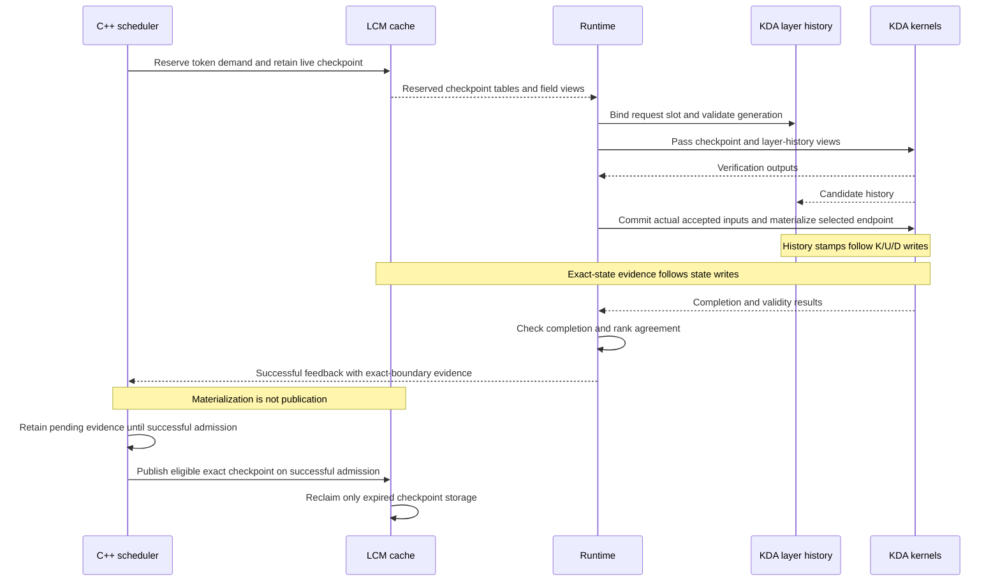
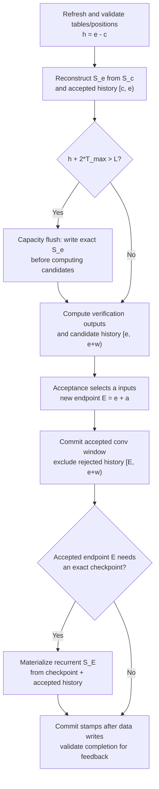

# Kimi-K3 Replay-SSM refactor

English | [简体中文](kda-replay-ssm-design.zh-CN.md)

Status: proposal for design discussion. The goal is to agree on the rationale,
ownership and scope of the cache, scheduler and KDA changes before deciding the
implementation plan. Sections 3–5 describe the proposed shared contracts;
Section 9 lists the decisions that need maintainer agreement.

The English document is normative and the Chinese document is its synchronized
translation. Update both in the same PR; resolve translation ambiguity in favor
of the English text.

## 1. Problem and scope

Kimi-K3's current speculative path verifies a candidate window, then replays the
accepted inputs to commit convolution and recurrent state. Ordinary decode also
writes the full recurrent state every step. Repeated replay and full-state
writes are expensive relative to the small number of accepted tokens.

This differs from the baseline behind ReplaySSM's published concurrency gains:
TokenSpeed's current Kimi-K3 path does not retain a full state snapshot for each
draft token. The blog's concurrency recovery from eliminating per-draft
snapshots therefore does not transfer directly. This proposal targets
post-acceptance replay and amortized full-state **writes**, purchased with
per-live-request history and lagging-checkpoint capacity.

The current speculative accepted-state commit also runs eagerly after decode
graph replay. The replacement brings commit into the unified graph-stable
lifecycle. That is a TokenSpeed-specific potential benefit, but measure it
separately from replay/write reduction rather than treating it as guaranteed.

The proposal keeps an exact recurrent checkpoint plus compact accepted history.
Forward reconstructs the current state, produces outputs and candidate history,
and acceptance commits only the accepted prefix. Full recurrent state is written
when capacity requires it or an exact snapshot is needed. This replaces routine
post-acceptance recurrent replay; it does not eliminate state reconstruction or
every endpoint write.

The key change is the lifetime of cached decode inputs. The current path does
have cached recurrent/conv state and per-round speculative workspace; it does
not retain accepted K/U/D history across decode rounds. The replacement makes
that accepted history persistent in a fixed-capacity buffer owned by each KDA
layer class. LCM continues to own exact recurrent and convolution checkpoints.

| Concern | Current implementation | Replay-SSM replacement |
| --- | --- | --- |
| Logical state at round entry | Exact recurrent `S_e` from the preceding round. | Exact checkpoint `S_c` plus accepted history `[c,e)` represents logical `S_e`. |
| Standard decode | Update and write the full exact recurrent state for every token. | Use the same protocol with `T=1`; append one accepted history entry and materialize only when required. |
| Speculative verify | Keep the current candidate window's projections/intermediates in per-round workspace. | Produce candidate K/U/D history `[e,e+w)` against the reconstructed state. |
| After acceptance | Replay the accepted prefix from the per-round workspace and write exact `S_e`. | Promote `[e,e+a)` into persistent accepted history; exclude rejected `[e+a,e+w)` without post-acceptance recurrent replay. |
| History lifetime and owner | Candidate intermediates are valid only for the current verify/commit round and are backend workspace. | Accepted history survives across rounds for the live request in a KDA-layer-owned buffer. Runtime request-slot lifecycle controls initialization and reset. |
| Full-state materialization | Standard decode writes every step; speculative decode writes after every accepted replay. | Write on capacity flush, an aligned reusable checkpoint, or another explicit snapshot boundary. |
| Reuse scope | Candidate intermediates are reused only within the current round. | Later rounds of the same live request reuse accepted history; another request never inherits it. Prefix reuse still starts from an exact checkpoint and empty history. |
| Standard/speculative relationship | Different state-maintenance behavior. | One prepare → reconstruct → forward → acceptance → commit protocol; only `T` and accepted count differ. |

In this document, **history reuse** means promoting the accepted part of the
current candidate window into request-local storage and consuming it in later
rounds of that same request. It never means cross-request prefix reuse or reuse
of a rejected suffix.

Ordinary decode (`T=1`) and speculative verification use the same protocol.
Prefill continues to consume and produce exact states. The proposed initial
scope is Kimi-K3 on Blackwell with BF16 activations, FP32 recurrent state, head
dimension 128 and maximum verification width `T_max=1` or `4`. Validation should
use real NVFP4 weights with TP8; weight precision does not change state precision.

Non-goals are output-only attention, changing sampling/acceptance rules, and
transferring a live buffered request between prefill/decode workers. The repo
already has an opt-in `--enable-replay-ssm` path for selected Qwen GDN models;
this design neither changes nor removes it, and it is not precedent for keeping
a legacy/new selector for KDA. Any later convergence of their cache or kernel
protocols needs a separate design. Other models retain zero lag and existing
behavior.

## 2. Upstream prerequisites and related PRs

| Work | Status | Scope |
| --- | --- | --- |
| [Upstream #1597](https://github.com/lightseekorg/tokenspeed/pull/1597) | Merged | Provides the exact computed frontier and pending materialized-boundary tracking. Reuse this foundation rather than duplicate the fix. |
| [Fork #3](https://github.com/byshiue/tokenspeed/pull/3) | Open, under review | Proposes bounded live-state retention through `max_state_lag_tokens`, shared reclaim rules and capacity budgets. Replay history, kernels and serving integration remain outside that PR. |

These PRs provide context for the shared contracts below; they do not settle
the scope of the remaining replay refactor.

Use #1597's `Request::NumComputedTokens()` as the frontier: during decode this is
`TokenSize() - 1`, excluding the last sampled token. Retain all known materialized
boundaries until successful admission publishes them.

## 3. State representation and ownership

For each request and KDA layer, let `e` be the number of accepted inputs already
consumed, `c` the recurrent checkpoint position, and `w <= T_max` the current
candidate width:

```text
exact recurrent S_c + accepted history [c, e) = logical recurrent S_e
                      candidate history [e, e+w) is not committed yet
```

The canonical record stores FP32 normalized key `K_i`, correction vector
`U_i`, and token-local multiplicative decay `D_i`. KDA decay is per key
channel. It is not a scalar or a product across tokens. For state layout
`[value_dim, key_dim]`, record `i` defines:

```text
S_(i+1) = S_i * D_i[None, :] + U_i[:, None] * K_i[None, :]
```

The producer computes `U_i` from the state after decay, using the current
token's value and beta. Recovery uses the saved correction; it does not
compute that projection again. Each record also has an absolute input position
and validity information. Queries are used for outputs and are not retained.
Rejected records never enter logical history.

The vLLM Kimi-K3 RecoverSSM source uses FP32 corrections and activation-dtype
raw keys/gates. The adapter produces canonical FP32 K/U/D from raw projection
inputs with main's FP32 replay arithmetic. A cast from the rounded verify
inputs is insufficient. Each U comes from the record chain's own post-decay
state. The adapter preserves token-local KDA vector decay; it does not import
the scalar-decay GDN protocol. The vendored recovery kernel is adapted to
read the FP32 records directly; its provenance notes list that change.
Sections 7 and 9 define the acceptance checks.

Convolution uses a separate payload: the initial convolution window plus the
current round's raw convolution inputs. It is not reconstructed from K/U/D.
The accepted convolution window remains in the existing state storage.

The live convolution window stays at accepted endpoint `e`; the recurrent
checkpoint may remain at `c`. The live window uses a writable continuation
slot. An exact checkpoint has its own convolution window at the same endpoint
as its recurrent state. Never advance or overwrite a published checkpoint's
convolution window. The live window plus lagging recurrent state is valid only
with accepted history and is not a reusable exact snapshot.

When a capacity flush stores `S_e`, copy the current live convolution window
into that checkpoint's destination. When acceptance selects an aligned
endpoint `E`, derive its window from the round-entry window and accepted raw
convolution inputs, and write it beside `S_E`. Publish only after both writes
complete. Retraction follows the existing prefix-recovery protocol. It can recover
from an available exact published recurrent/conv pair or recompute from an
earlier prefix. A private capacity-flush checkpoint is not a new recovery
source. The live continuation window is not a reusable checkpoint.

| Owner | Responsibility |
| --- | --- |
| LCM cache | Exact recurrent and convolution checkpoints, allocation, prefix snapshot immutability, in-flight fences and reclamation. It does not store replay history. |
| C++ scheduler | Token-level state demand, bounded checkpoint retention and admission, exact checkpoint publication, request lifecycle and recovery. It does not allocate or inspect per-layer replay history. |
| Runtime and KDA layer class | Assign a stable request slot and generation, own the fixed-capacity K/U/D history buffer for each layer, refresh graph-stable metadata, reset reused slots, and order forward/acceptance/commit. |
| `tokenspeed-kernel` | Validate layer-buffer metadata, reconstruct state, compute outputs/history, and write selected states/windows/stamps into caller-provided views. It has no checkpoint allocation or publication authority. |

Each KDA layer class owns one persistent, fixed-address replay-history ring.
The ring is private to the layer and is indexed by a runtime-assigned request
slot and generation. It is not an LCM cache group. This is an explicit
backend-private-state exception: the history is small, bounded, consumed only
by KDA, excluded from prefix reuse and host transfer, and useful only while the
request stays live on the same worker. Exact checkpoints remain in LCM so a
request can recover after retraction, prefix reuse or buffer reset.

## 4. Cache management contract

### Bounded checkpoint retention — fork #3

`max_state_lag_tokens=d` tells the allocator how far behind computed progress a
live consumer may still read. It changes retention, not prefix identity or state
block granularity. For state span `G` and progress `p`, slots below
`max(0, floor((p-d-1)/G))` may expire: a state at endpoint `c` occupies slot
`floor((c-1)/G)`. Endpoint zero uses the initial zero state.

Admission reclaim credit, victim planning, reservation and actual reclamation
must share this calculation. Otherwise admission can promise memory that a live
checkpoint still needs. Startup budgets add `ceil(d/G)` state blocks per live
request to the existing working set, including prefill input/checkpoint/tail and
overlap protection. Lag is not a replacement for those allowances.
LCM also reserves one writable convolution continuation block per live request
for PR2, unless an existing working-set allowance already provides a distinct
block. Startup accounting must demonstrate that reuse before omitting it.
A flush writes to an allocated unpublished destination. An in-place write is
allowed only when the old checkpoint is unpublished and all old readers have
completed. Published checkpoints are immutable.

The Python cache spec, bridge, C++ config and serialized contract carry the same
explicit value. Unaffected recipes keep zero lag. Runtime and scheduler bindings
must be rebuilt together; missing contract fields must not silently assume a value.

### Request-local history — KDA layer buffer

Each KDA layer allocates a fixed-address GPU buffer at startup. Its logical
shape is `[max_request_slots, L, local_heads, ...]` for K, U and D, plus
per-slot metadata. The allocation is independent of LCM page allocation and
does not add dynamic LCM demand. `max_request_slots` must cover the maximum
number of requests that can stay resident on the worker. Startup must reject a
configuration in which the runtime can exhaust layer-buffer slots.

The initial policy uses history capacity `L` and state lag `d=L-T_max`, with
`L >= 2*T_max`. The layer buffer follows these rules:

- Runtime assigns one stable request slot while a request is live. All KDA
  layers use that slot to address their own buffer.
- Each slot records a generation, checkpoint position `c`, accepted endpoint
  `e`, ring origin and position stamps. A row is valid only when its generation
  and absolute token position match the current request.
- Kernels may map an absolute token position to a physical row modulo `L`.
  Position stamps prevent stale or rejected rows from becoming logical history.
- Candidate history `[e,e+w)` is written into the same slot. Acceptance
  advances `e`; rejected rows remain invalid and may be overwritten.
- Prefill and prefix hits start from an exact LCM checkpoint and initialize an
  empty layer-buffer history. Long prefill never stores replay history for the
  complete prompt.
- Slot reuse waits for all in-flight readers and writers. Runtime then increments
  the generation and resets metadata before assigning the slot to another
  request. A generation mismatch is an invariant failure, not an empty history.
- History is excluded from LCM prefix publication, canonicalization, host
  writeback and P-D transfer. Only a materialized exact checkpoint can cross
  those boundaries.

For scale, FP32 history costs `4*(2*D_k+D_v)` bytes per head/token. With TP8,
69 local KDA layers, 12 local heads and `D_k=D_v=128`, `L=8` needs about
**9.7 MiB per configured request slot per GPU** in logical K/U/D payload.
Because the layer buffer is allocated at startup, multiply this value by
`max_request_slots`, not by the instantaneous live-request count. This is an
analytical estimate: add retained LCM state blocks, generations, stamps and
runtime scratch. Larger `L` also increases reconstruction work.

## 5. Scheduler and lifecycle changes

The scheduler retains one admission/forward path. It schedules logical tokens
and cache demands; it does not inspect per-layer history or shorten a verify
window to fit a backend buffer. Flush decisions remain per-request device data.

Beyond bounded checkpoint retention, the scheduler has no replay-history
demand. Runtime maps request start, finish, cancellation and retraction to safe
layer-buffer slot initialization or reset. Publication builds on #1597: record an
aligned boundary only after that exact accepted endpoint was materialized.
Crossing a boundary, allocating a block, committing convolution, or planning a
capacity flush does not establish an exact reusable snapshot. Failed admission
must not consume pending materialization evidence; publish before reclaiming.

Lifecycle requirements are:

- **Prefill → decode / prefix hit:** start from an exact checkpoint and empty
  layer-buffer history. Agentic continuations arrive as new requests using prefix
  matching, not live `Decoding → Prefilling` transitions.
- **Accepted boundary:** selectively materialize the actual aligned accepted
  endpoint before reporting it as reusable; do not invent every crossed state.
- **Retraction:** retain existing exact-prefix checkpoint recovery and suffix
  recomputation. Invalidate the layer-buffer generation before slot reuse. Do
  not export live history as an exact state.
- **Finish/cancel:** no final full-state write is required unless a snapshot is
  being published. Preserve the slot until all readers/writers finish, then
  increment its generation and reset its metadata.
- **Direct live handoff / P-D transfer:** require quiescent endpoint
  materialization using fresh tables before admission reshapes or reclaims them.
  Keep these configurations outside the replacement PR. A future
  handoff requires materialization and a new layer-buffer slot on the receiver.

GPU validation flags travel through the normal forward-result path. CPU/rank
agreement must complete before successful scheduler feedback. An invalid backing
or missing required result is a cache invariant failure, not a silent fallback.
The event loop does not launch GPU work or inspect device history.

### From allocation to a reusable checkpoint

This sequence follows a round that materializes an aligned accepted endpoint.
It shows ownership and ordering, not a new synchronization barrier per round.
Overlapped execution must preserve the same dependencies.


```mermaid
sequenceDiagram
    participant S as C++ scheduler
    participant C as LCM cache
    participant R as Runtime
    participant H as KDA layer history
    participant K as KDA kernels
    S->>C: Reserve token demand and retain live checkpoint
    C-->>R: Reserved checkpoint tables and field views
    R->>H: Bind request slot and validate generation
    R->>K: Pass checkpoint and layer-history views
    K-->>R: Verification outputs
    K-->>H: Candidate history
    R->>K: Commit actual accepted inputs and materialize selected endpoint
    Note over H,K: History stamps follow K/U/D writes
    Note over C,K: Exact-state evidence follows state writes
    K-->>R: Completion and validity results
    R->>R: Check completion and rank agreement
    R-->>S: Successful feedback with exact-boundary evidence
    Note over S,C: Materialization is not publication
    S->>S: Retain pending evidence until successful admission
    S->>C: Publish eligible exact checkpoint on successful admission
    C->>C: Reclaim only expired checkpoint storage
```

Only the exact checkpoint becomes reusable; live history remains request-local.
Failed validation sends no successful feedback. Failed admission retains the
pending evidence for a later attempt.

## 6. KDA kernel and runtime interface

The interface should separate per-group metadata preparation, per-layer forward
and accepted commit, with kernels exposed through `tokenspeed-kernel`. The table
defines responsibilities and data flow; API names and physical layouts are
implementation choices to review after agreeing on this contract.

| Phase | Inputs | Outputs / side effects |
| --- | --- | --- |
| Prepare and validate, once per group | Current checkpoint tables, request slots and generations, accepted endpoints, valid widths, `L`, `T_max` | Checkpoint positions, history lengths, flush masks and layer-buffer validity flags in fixed buffers. |
| Forward, per layer | Q/K/V and gate producers, checkpoint views, layer-owned history views and prepared positions | Verification outputs and candidate K/U/D in the request slot; optionally an exact pre-candidate checkpoint. |
| Accepted commit, after layer forwards | Actual accepted input counts, candidate payload, endpoint masks, request slots and generations | Accepted convolution window, selected exact recurrent endpoints and ordered layer-history stamps. |
| Quiescent materialization, for a future live handoff | Fresh request tables and accepted endpoints | Exact endpoint states and completion validity, without consuming candidates or requiring space for another window. Future extension; live handoff is outside the replacement PR. |

### One decode round

The flow below is for a valid, active request. Both ordinary and speculative
decode follow it; the width and accepted count differ. Diamonds represent
per-request device masks, not CPU branches or separate CUDA graphs.


```mermaid
flowchart TD
    A["Refresh and validate tables/positions<br/>h = e - c"]
    B["Reconstruct S_e from S_c<br/>and accepted history [c, e)"]
    C{"h + 2*T_max > L?"}
    D["Capacity flush: write exact S_e<br/>before computing candidates"]
    E["Compute verification outputs<br/>and candidate history [e, e+w)"]
    F["Acceptance selects a inputs<br/>new endpoint E = e + a"]
    G["Commit accepted conv window<br/>exclude rejected history [E, e+w)"]
    H{"Accepted endpoint E needs<br/>an exact checkpoint?"}
    I["Materialize recurrent S_E<br/>from checkpoint + accepted history"]
    J["Commit stamps after data writes<br/>validate completion for feedback"]

    A --> B --> C
    C -->|Yes| D --> E
    C -->|No| E
    E --> F --> G --> H
    H -->|Yes| I --> J
    H -->|No| J
```

The forward/reconstruction work runs per layer; acceptance and the selected
endpoint commit follow the layer forwards. `a` includes the target input, not
just draft matches; do not add another token. Ordinary decode has `a=1`;
padding has `a=0` and no mutations. Rejected bytes need not be erased: the
committed endpoint excludes them.

Capacity flush writes the **old accepted endpoint `e`**, never candidates. The
post-acceptance writer instead materializes the **new endpoint `E`** when needed
for an exact aligned snapshot. That snapshot still requires the publication
sequence above. If no endpoint write is needed, checkpoint plus accepted history
continues to represent the current state.

Capacity flush does not require another recurrence: forward has already
reconstructed `S_e` from `S_c` and `[c,e)`, so flush stores that result. This
mitigates the extra compute of frequent flushes at small `L`, but does not
remove their full-state write traffic.

All destinations must be writable and validated before stores. Commit stamps
only after the corresponding data are ready. Mixed flush/no-flush requests,
partial acceptance and padding use the same eager/CUDA-graph sequence. Metadata
and scratch have stable addresses and cover the runtime batch bound, not just
the graph capture sizes. Mixed prefill/decode batches keep exact-state prefill
and use the same commit protocol for their decode suffix.

Keep capacity fixed at startup and require `L >= 2*T_max`. The final option
name, supported upper limit and recipe default remain review decisions.
Capacity tunes Replay-SSM's resource/performance tradeoff; it must not select a
legacy KDA implementation. After replacement, reject unsupported hardware,
layout or capacity combinations at startup.

### Why flush one window early?

The initial policy follows [ReplaySSM Section 5.3](https://dao-lab.ai/blog/2026/replayssm/#53-speculative-decoding):
flush when `h + 2*T_max > L`. Its [public GDN implementation](https://github.com/Johnny-Liou/ReplaySSM/blob/a84849410ab56cc2b23432969eb2ecfc42a13d9c/vllm/model_executor/layers/fla/ops/gdn_replayssm_spec_decode.py#L382)
uses the same test to prepare the next round's flush flag. Here `h=e-c` is
accepted history at round entry, `L` covers history and candidates, and `T_max`
is the configured maximum input width, not the actual accepted count.

Flush is part of the layer forward, not a separate stage that releases history
storage before admitting the candidate window. Even a flush round must enter
with room for a full window: `h + T_max <= L`. Writing `S_e` alone does not
authorize reuse of history that other in-flight readers still need.

If this round does not flush, it can accept up to `T_max` inputs. The next round
must still have room for its candidates, including when that round flushes:

```text
Next history length:          h_next = h + a, where a <= T_max
Required next-round capacity: h_next + T_max <= L
Safe not to flush this round: h + 2*T_max <= L
```

The two windows budget this round's possible accepted inputs and the next
round's candidates; they do not mean two rounds execute concurrently. This
also preserves the declared state-lag bound `d=L-T_max`. After a capacity
flush, the checkpoint advances to `e` and the new history contains only this
round's accepted inputs, so `h_next=a <= T_max <= L-T_max`. A separate exact
endpoint write can reduce the lag further.

For `L=8,T_max=4`, the flush test reduces to `h>0`. Starting with empty history,
and ignoring additional exact-endpoint writes:

| Round | History at entry `h` | Capacity flush? | Accepted inputs `a` | History after commit |
| --- | --- | --- | --- | --- |
| 1 | 0 | No | 2 | 2 |
| 2 | 2 | Yes | 1 | 1 |
| 3 | 1 | Yes | 3 | 3 |
| 4 | 3 | Yes | 3 | 3 |

Flushing every round after the first is expected here, but it loses the benefit
of amortizing full-state writes across rounds. `L=8` is the legal minimum for
`T_max=4`, not a recommended performance setting. With `L=16,T_max=4`, capacity
flush instead triggers at `h>8`, allowing history to span multiple rounds.
Larger buffers also cost memory and reconstruction work, so capacity needs
measurement rather than a larger-is-better assumption.

The two-window rule is a buffer-lifetime policy, not an SSM mathematical
requirement or a consequence of parallel verification. Serial recurrence alone
does not relax it. A one-window condition such as `h+w>L` would need a protocol
that finishes flush and safely releases old history before reusing its space
for candidates. That requires reviewing execution ordering, in-flight readers,
entry validation and LCM retention/admission bounds together; changing only
`2*T_max` to `T_max` would violate the current `h<=L-T_max` entry contract.
Keep that alternative a separate design decision.

## 7. Numerical contract and optimization approach

State reconstruction must preserve the ordered FP32 KDA updates. Algebraic
equivalence alone is insufficient: changed rounding can alter verify outputs,
acceptance length and end-to-end performance.

The following gate applies before PR1 review and remains in force for PR2.
Fix the reference commit, seeds and test corpus before optimization. Do not
relax thresholds after inspecting results.

| Check | Required result |
| --- | --- |
| FP32 scalar reference | Verify outputs: `atol=2e-2, rtol=2e-2` after BF16 output conversion. Recurrent state: `atol=3e-2, rtol=2e-2`. These are the existing RecoverSSM reference-test limits. Report maximum and RMS error as well as pass/fail. |
| Differential against main | Verify outputs use the fixed `atol=2e-2, rtol=2e-2` after BF16 conversion. Preserve existing regression limits. Accepted recurrent state uses `atol=1e-5, rtol=1e-3`; do not replace this with the looser scalar-reference limit. Convolution endpoints, checkpoint positions, accepted counts and padding effects must match exactly. Reject NaN/Inf. |
| Deterministic serving corpus | Identical greedy output tokens and per-round acceptance counts for fixed prompts, weights, seed and token limits. Include standard decode and MTP3. |
| AIME 2026 | Same dataset, prompt template, sampling settings and answer parser. No lower number of correct answers in the paired deterministic run. Retain per-question results. |
| Performance | Pass the fixed protocol in Section 9.1. Correctness and speed are independent requirements. |

The tolerances measure numerical agreement; they do not permit a different
logical endpoint or stale history. Bitwise FP32 state equality is not promised.
The deterministic serving gate tests whether rounding changes affect decoding.
If a gate fails, investigate and revise the implementation. A change to the
numerical contract requires a separate design decision.

The record producer and recovery must use the same normalization, gate transform, update
order and FP32 rounding rules. K/U/D are stored after the required FP32
operations. Do not cast them to BF16 or preweight one field by cumulative decay.
Tensor-core reassociation is outside these PRs.

The current NVIDIA path has two producer precisions. Verify consumes BF16
convolution and gate outputs. Accepted-state replay recomputes convolution and
gates in FP32. Records for recovery must use the latter arithmetic. Corrections
from the rounded verify inputs are not interchangeable with replay corrections.

PR1 must retain verify outputs and main's accepted-state recurrence. One
implementation uses two register-local state chains in the producer: one for
verify outputs, one for FP32 recovery records. The extra arithmetic is a cost
to measure, not an assumed optimization. Producer fusion may remove launches
only if both numerical contracts remain satisfied.

Both chains start from the same FP32 accepted checkpoint and committed BF16
convolution window. The record chain uses main replay's convolution tap order,
FP32 accumulation and activation, and FP32 gate transform. It must not read
the verify chain's rounded intermediates or recurrent state. Test this by
changing the verify inputs while keeping the record inputs fixed; saved
records and recovered state must not change.

PR1 leaves standard decode unchanged. For PR2, compare T=1 against main's
standard fused decode, not against the split BF16 verify path. Main's fused
decode computes convolution, activation and gates in FP32 registers. Use the
same FP32 record protocol and the strict accepted-state tolerance above. Do
not infer T=1 correctness from a width-one speculative test.

The multi-round PR1 reference is sequential main accepted-state replay. Each
round commits a new exact checkpoint, then starts the next round from it.
This is not a cross-round history test. PR2 must pass the same strict state
limit with retained history up to L-T_max, including wraparound at L=8/16/32.
Report maximum and RMS error in both cases.

Report verify-only latency as well as total KDA time. Include register count,
spills and occupancy for the two-chain producer. If the performance gate
fails, optimize within this contract. Different fusion or a separate record
kernel may be tested. Verify-derived corrections and relaxed tolerances are
not remedies for a performance failure.

Potential optimizations, subject to that contract, include:

- Fuse compatible conv/gate producers to reduce launches without changing the
  required precision or rounding.
- Reuse reconstructed state, interleave independent work and tune reduction
  layouts to reduce recurrence overhead.
- Batch shared metadata and selected-endpoint writes across layers where
  dependencies allow it.

The baseline proposal keeps capacity flush inside per-layer forward. Moving it
across layers changes execution ordering and needs separate review. Output-only
algebra and reassociated tensor-core reconstruction are also separate proposals,
not prerequisites for agreeing on cache ownership. Backend selection, including
CuteDSL, must stay behind `tokenspeed-kernel`; runtime should not gain direct
vendor dependencies.

## 8. Expected benefit and tradeoffs

The intended benefits are eliminating post-acceptance replay, amortizing full
state writes, and bringing accepted commit into the unified graph-stable decode
lifecycle. This is not the blog's concurrency optimization from removing
per-draft state snapshots: the current Kimi-K3 baseline does not have those
snapshots.

A full state has `D_k*D_v` elements per head; one history entry has
`2*D_k+D_v`. At dimension 128 in FP32 these are 64 KiB and 1.5 KiB,
respectively, about a 43× size gap. That motivates exchanging small per-token
storage for fewer full-state writes; it is not an end-to-end speedup estimate.

Account for all of the following costs:

- Output-only attention is out of scope, so every round still reads full `S_c`
  and reconstructs `S_e`. Full-state read traffic does not shrink, while
  reconstruction reads and arithmetic grow with `h`. The blog's near-halving
  of state traffic with output-only attention does not apply directly.
- At TP8, the K/U/D payload is about 9.7 MiB/request/GPU for `L=8`, hence about
  19.4 MiB/request/GPU for `L=16`. At 256 live requests, history alone is about
  4.85 GiB/GPU, before lagging checkpoints, stamps, page rounding,
  candidate/overlap protection and runtime scratch.
- State lag `d=L-T_max` also raises retraction cost. The newest publishable
  live checkpoint is bounded by `d`, but the newest available prefix checkpoint
  is not. Recovery cost depends on published-prefix availability and eviction.
  Measure the actual recomputed tokens; do not claim an upper bound of `d`.
- Larger `L` may reduce flushes and full-state writes, but increases memory,
  history reads and reconstruction work. Extra metadata/commit launches can
  offset kernel gains.

The final PR must therefore sweep `L ∈ {8,16,32}` against target concurrency
and report latency, throughput, GPU memory, flush frequency, retraction recovery
cost and acceptance. Select a recipe default only from those results. These are
hypotheses to evaluate, not promised performance gains. Merge the replacement
only after the agreed correctness and E2E performance criteria pass; a permanent
legacy/new implementation switch is not a substitute for acceptance.

## 9. Review decisions and delivery gates

Before proceeding, cache, scheduler and KDA maintainers should agree whether
reduced full-state writes/replay justify the extra storage and reconstruction
work for the target workload. Then settle:

1. Bounded lag semantics, the shared expiry rule, and admission/startup budgets
   under #1597's exact frontier.
2. Layer-owned request history, its fixed capacity, request-slot generation and
   reset rules, memory budget, and exclusion from prefix reuse/host writeback.
3. Publication evidence and completion ordering: what proves an exact state,
   how failed admissions retain evidence, and how overlap protects live storage.
4. Lifecycle boundaries: exact-state recovery, cancellation fences and keeping
   direct live handoff/P-D transfer gated until owner-level integration exists.
5. Numerical scope: use the pre-quantified tolerance and two-producer-precision contract, and
   use the fixed output/state, acceptance, AIME and E2E gates below. Both PRs
   must pass these gates before review is complete.
6. Replacement scope: supported shapes and capacities, public API boundaries,
   the `L ∈ {8,16,32}` × target-concurrency sweep, and which kernel
   optimizations should remain separate follow-up work.

### 9.1 Two-PR implementation plan

The feature lands through two implementation PRs. Each merged revision has one
serving path. Neither PR adds a legacy/new environment variable, CLI option or
runtime selector. A separate worktree or baseline binary may be used for
offline comparison.

Upstream #1597 is a prerequisite for both PRs. Bounded checkpoint retention from
fork #3, or an equivalent reviewed change, is a prerequisite for PR2. Small
behavior-preserving changes to shared request-slot or decode descriptors may
land separately only when the current implementation uses and validates them;
they must not install an unused Replay-SSM branch.

#### Gate before PR1: one composable replay record

PR1 and PR2 use the FP32 K/U/D record defined in Section 3. Recovery consumes
`(S_c, record_view, c, E)`. The view contains buffer strides, capacity `R`,
request slot, generation and absolute-position stamps. It maps position `i`
to row `i % R`. It must reject invalid rows before using them.

PR1 uses `R=T_max`, begins each round with `c=e`, and recovers only the
accepted prefix. PR2 changes capacity to `L`, extends the lifetime of
accepted rows and adds reconstruction in forward. It keeps the record math
and recovery interface. Internal tiling can change without changing this
contract. A PR1 implementation that needs a different record format in PR2
does not pass this gate.

Before PR1 is accepted, an attention-only test must prove composition:

```text
Replay(S_c, accepted records from all windows)
    ~= SequentialUpdate(S_c, the same accepted inputs)
```

Produce each later window through the actual verify producer, starting from
the reconstructed preceding endpoint. Do not generate all records from an
independent reference, since that would miss producer/recovery drift. Test
T=1 and T=4, every accepted length, mixed batches, padding, rejected suffixes,
R=8/16/32, ring wraparound and at least 128 rounds with repeated checkpoint
resets. Include stale generations and slot reuse. Check recurrent states,
outputs, convolution endpoints and validity stamps. The test uses a local
ring harness; PR1 serving still discards records after each round.

#### PR1: replace current-round accepted-state replay

PR1 replaces the current Kimi-K3 speculative accepted-state replay with the
vLLM RecoverSSM kernel structure. It is an atomic replacement of the current
replay implementation, not a new mode.

```text
verify candidates
    -> write canonical replay records to fixed-address per-round workspace
    -> receive accepted length
    -> run one shared recovery plan
    -> recover and commit all KDA layers
    -> write exact recurrent and convolution state
    -> discard the per-round records
```

PR1 has these boundaries:

- Replay records live for one decode round only.
- LCM and scheduler semantics do not change.
- Every round still commits an exact recurrent and convolution endpoint.
- Standard decode keeps its current state-maintenance behavior.
- Planning is shared across layers. It computes accepted lengths, source and
  destination state IDs, aligned-boundary lengths and validity masks once.
  Layer pointer tables supply layer-specific addresses. The expected commit
  sequence has one planner launch, one all-layer recurrent recovery launch
  and one all-layer convolution commit launch.
- Kernel code copied from vLLM stays under `tokenspeed-kernel/thirdparty/`,
  preserves its Apache-2.0 license and is exposed through a registered
  `tokenspeed-kernel` operation.
- The old post-acceptance replay kernel and orchestration are removed in the
  same PR.

PR1 keeps the current commit lifecycle: verify can run in the decode CUDA
graph; accepted-state recovery runs after acceptance on the ordered stream.
Eager and graph verify use the same record buffers and commit entry point.
Capturing the complete acceptance/commit sequence is PR2 work. Test the kernels
under graph capture separately, but do not report that as E2E graph coverage.

Allocate record and plan buffers before capture. Size them for the maximum
runtime batch, including eager batches above the capture ladder. Keep their
addresses stable. Padding has accepted count zero and cannot read or write a
live state. Rebinding a state pool must invalidate pointer tables and rebuild
workspace before recapture. Per-round rows cannot be reused before commit
completion. Preserve existing overlap and feedback ordering.

Publish an exact endpoint only after both recurrent and convolution writes
complete at that endpoint. Preserve the existing scheduler publication event.
Do not publish on recurrent completion alone. Reclaim workspace only after
confirmed consumer completion.

For FP32 records, payload bytes per GPU are
`num_layers * max_runtime_batch * T_max * num_heads * 4*(2*D_k+D_v)`.
With 69 layers, 12 local heads, dimension 128 and T_max=4, this is about
4.85 MiB per configured batch slot. Also report convolution payload, pointer
tables, plan buffers and peak temporary storage. Workspace must be accounted
for during startup memory sizing. It must not silently reduce the usable cache
or maximum supported concurrency.

PR1 correctness covers Section 7 and the composition test above. Include
aligned checkpoint boundaries, all accepted lengths, source/destination alias
cases, padding, mixed batches, idle graphs, batches above the graph ladder,
pool rebind and overlap. Full-model validation uses real Kimi-K3 NVFP4 weights,
TP8, standard decode, MTP3, the agentic workflow and AIME 2026.

The performance protocol is fixed before tuning:

- Compare against unmodified remote main at the recorded rebase commit.
- Use the same GPU allocation, clocks/power policy, container, dependency
  versions, weights, model settings, prompt data and output limits.
- Measure KDA verify plus the complete accepted-state commit for B=4/8/16/32,
  T=1/4 and accepted lengths 1 through T. Report each component and the total.
- Measure agentic E2E for concurrency 4/8/16/32. Enable decode CUDA graphs in
  both arms. Run an eager correctness smoke test.
- Use at least ten independent server starts per arm. Alternate baseline
  and candidate order. Warm up each start. Retain raw per-request measurements.
- Report median and p99 TPOT, throughput, acceptance length, GPU memory and
  startup workspace. Use 10,000 bootstrap resamples of matched start-level log ratios and
  simultaneous 95% intervals across all cells and gated metrics, using the
  maximum standardized deviation in each resample. Use a predeclared 2% measurement margin: the upper latency-ratio
  bound must be at most 1.02, and the lower throughput-ratio bound at least
  0.98, in every E2E matrix cell. The KDA total must meet the same latency
  bound. Use a predeclared second batch of ten starts if the first batch is
  inconclusive. Recompute intervals over all twenty matched starts.
  Report an unresolved gate after that batch; do not stop early
  when an interval first passes.
- A statistically significant slowdown means the simultaneous interval's
  lower latency-ratio bound exceeds 1.0, or its upper throughput-ratio bound
  is below 1.0. It is a failure even within the 2%
  measurement margin. The margin handles uncertainty; it is not a speed-loss
  budget. A local KDA gain cannot override an E2E regression.

Record commands, commit IDs, environment, results and artifact paths in the
progress document. Keep the design documents on the PR1 branch during work;
remove them only in the final cleanup after validation and review.

#### PR2: retain accepted replay records across decode rounds

PR2 changes the lifetime and ownership of the PR1 records. It moves them from
per-round workspace into the fixed-address buffer owned by each KDA layer. It
does not introduce another replay arithmetic path.

```text
exact LCM checkpoint S_c
    + accepted layer-local records [c,e)
    + current candidates [e,e+w)
    -> reconstruct and verify
    -> retain only accepted records
    -> materialize exact state only at a required boundary
```

PR2 completes these items in one replacement:

- Add the per-layer K/U/D/stamp ring, request-slot generations, startup memory
  budget, completion fences and safe reset.
- Reuse accepted history across rounds and exclude rejected history.
- Add `h + 2*T_max > L` capacity flush and exact-endpoint materialization.
- Use bounded LCM checkpoint retention and publish only confirmed exact states.
- Make standard decode the same protocol with `T=1`; speculative decode uses
  the same path with a wider window.
- Remove per-round exact-state commit when no capacity or snapshot boundary
  requires it.
- Keep eager, CUDA graph, mixed-batch and overlap execution on one runtime path.

PR2 uses this execution order in both eager and CUDA graph runs:

```text
refresh stable metadata
    -> model forward (reconstruct, capacity flush, verify, candidate records)
    -> sampling/acceptance produces device accepted counts
    -> commit graph (conv endpoints, selected recurrent endpoints, stamps)
    -> existing ordered completion/feedback
```

The model forward and post-acceptance commit are separately captured graphs.
Acceptance may remain in its current execution mechanism between them.
Accepted counts are copied or written into fixed-address device buffers before
the commit graph runs on the ordered stream. Eager execution calls the same
forward and commit entry points. No CPU decision selects flush requests.

A fixed-address per-layer convolution workspace stores the round-entry window
and raw candidate inputs until commit completes. Its dimensions cover the
maximum runtime batch, channel count, conv width and T_max. The next round
cannot overwrite it before the ordered commit completes.

Before forward, scheduler admission reserves every state-table boundary that
the scheduled window can require, using the existing speculative state-demand
contract. Device acceptance selects among these destinations. Unused blocks
follow the existing reclamation rules. If the existing reservation is
insufficient, fix that contract in PR2 before enabling the kernel; a kernel
cannot allocate an unplanned endpoint after acceptance.

The runtime maps active batch rows to stable request slots. Padding maps to a
dedicated null slot with width and accepted count zero; kernels perform no
history, checkpoint or stamp writes for that slot. Slot storage covers all
resident requests, while row metadata covers the maximum runtime batch.
Neither is limited by the graph capture ladder. Pool rebind or slot-storage
replacement invalidates captures and pointer tables; reset generations,
rebuild metadata and recapture before serving. A slot is reused only after
all previous consumers complete.

The recurrent/conv pairing and publication rule in Section 3 applies to PR2
capacity flush and selected endpoint writes. Stamps and feedback follow both
writes. A capacity flush alone does not publish a prefix-cache entry.

PR2 must not keep PR1's per-round-only orchestration as a fallback. Kernel
specialization for `T=1` and `T>1` is allowed, but ownership, metadata,
commit and lifecycle remain one path.

PR2 validation adds multi-window composition, stale-generation rejection, slot
reuse, capacity flush, prefix hits, retraction, cancellation, tight memory,
`L ∈ {8,16,32}`, target concurrency, AIME and full agentic E2E performance.
Apply the PR1 performance protocol, including confidence intervals and the
2% uncertainty margin, to PR2 versus approved PR1. Sweep L=8/16/32 over the same
matrix. Each capacity offered for serving must pass correctness and
non-regression. A failing capacity remains test-only and cannot become a
recipe default. L=8 has no exception to this rule.

Run this protocol independently for the standard-decode recipe (T_max=1)
and the MTP3 recipe (T_max=4). Each has its own capacity selection. For each
recipe and capacity, require non-regression versus approved PR1 in every cell
and gated metric. Also measure against the fixed unmodified-main commit.
Compute the geometric mean of the throughput ratios versus main, with equal
weight per concurrency. Bootstrap the complete matched-start vector to retain
correlation across cells. A benefit requires its simultaneous 95% lower bound
to exceed 1.0. A passing capacity meets all correctness checks, all per-cell
non-regression gates versus PR1 and main, and this aggregate benefit gate.
Select the smallest capacity whose aggregate throughput is within 2% of the
best passing capacity. If no capacity passes, PR2 is not ready
to merge. This rule is fixed before the sweep.

Live-request handoff/P-D, output-only or window-parallel KDA, dynamic `L`, and
generalization to GDN/Qwen or other linear-attention models remain future work.
The checkpoint, replay-record and request-slot interfaces may support that work,
but must not pre-install unapproved serving branches.

## References

- [Cache concepts](cache-concepts.md), [scheduler](scheduler.md),
  [unified execution](unified_path.md), [event loop](event-loop.md).
