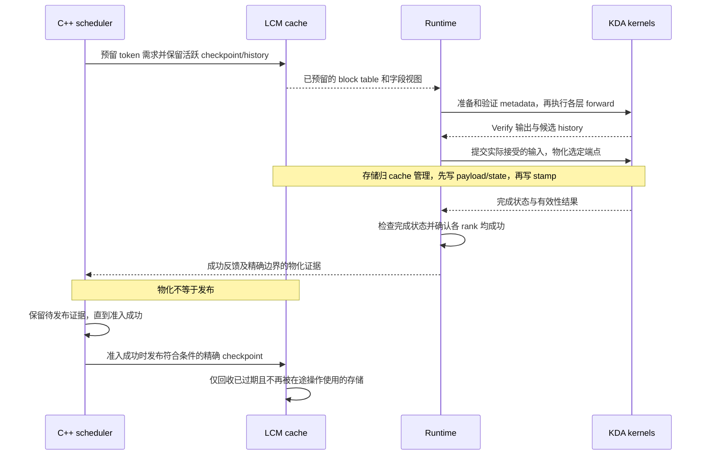
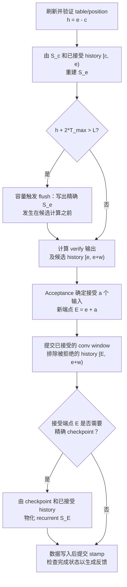

# Kimi-K3 Replay-SSM 重构设计

[English](kda-replay-ssm-design.md) | 简体中文

状态：供讨论的设计提案。希望先与维护者对齐 cache、scheduler 和 KDA 改动的理由、
职责与范围，再确定实现计划。第 3–5 节说明拟议的共享协议；
第 9 节列出需要共同决定的事项。

## 1. 问题与范围

Kimi-K3 现有的 speculative 路径先验证一组候选 token，再重放被接受的输入，提交
convolution state 和 recurrent state。普通 decode 则每一步都写回完整的 recurrent
state。当每轮只接受少量 token 时，重复 replay 和完整 state 写回的开销较大。

本方案保留一个精确的 recurrent checkpoint，以及 checkpoint 之后紧凑的已接受历史。
Forward 重建当前 state，计算输出并生成候选 history；acceptance 确定后，只提交被接受
的前缀。仅在容量不足或需要精确快照时，才将完整 recurrent state 写回 cache，
下文称为“物化”。这替代了每轮 acceptance 后例行执行的 recurrent replay，
但并不消除 state 重建，也不意味着永远不需要写出端点 state。

普通 decode（`T=1`）和 speculative verify 使用同一套协议。Prefill 仍然读取和输出
精确 state。正式替换的范围聚焦 Blackwell 上的 Kimi-K3：BF16 activation、FP32 recurrent
state、head dimension 128，最大 verify 宽度 `T_max=1` 或 `4`。
计划使用真实 NVFP4 权重、TP8 进行验证；权重精度不改变 state 的精度。

本次替换不包含 output-only attention、sampling/acceptance 规则修改、GDN/Qwen 模型的
buffered replay，也不支持在 prefill/decode worker 之间迁移仍携带 buffered history
的活跃请求。其他模型保持零滞后配置和现有行为。

## 2. 上游前提与相关 PR

| 工作 | 状态 | 范围 |
| --- | --- | --- |
| [上游 #1597](https://github.com/lightseekorg/tokenspeed/pull/1597) | 已合并 | 提供精确 computed frontier 和待发布物化边界的跟踪机制。沿用这项基础能力，不重复实现修复。 |
| [Fork #3](https://github.com/byshiue/tokenspeed/pull/3) | 评审中，尚未合并 | 提议通过 `max_state_lag_tokens`、统一回收规则和容量预算，支持有界滞后的 live-state 保留。Replay history、kernel 和 serving 接入不在该 PR 范围内。 |

这两个 PR 是下文共享协议的背景，不代表其余 replay 重构的范围已经确定。

以 #1597 的 `Request::NumComputedTokens()` 作为计算进度边界：decode 时为
`TokenSize() - 1`，不包括最后一个刚采样、尚未作为输入计算的 token。
所有已确认物化的边界都要保留到成功准入并发布为止。

## 3. State 表示与职责划分

对于每个请求的每个 KDA layer，令 `e` 表示已接受且已经完成计算的输入 token 数，
`c` 为 recurrent checkpoint 的位置，`w <= T_max` 为当前候选窗口宽度：

```text
精确 recurrent S_c + 已接受 history [c, e) = 逻辑 recurrent S_e
                    候选 history [e, e+w) 尚未提交
```

拟议的 history 为每个 token 保存 FP32 normalized key `K`、correction vector `U`
和乘法 decay `D`。KDA 的 decay 按 key channel 变化，不是一个标量。Query 只用于当前输出，
不需要长期保留。被拒绝的候选即使仍有数据留在已分配的内存中，也不属于逻辑 state。

较小的 convolution window 始终对应已接受端点 `e`，recurrent state 则可以停留在
`c`。二者必须结合已接受 history 才能表示当前状态。只有 recurrent state 也物化到
所声明的端点后，才是可用于 prefix reuse 或传输的精确快照。

| 负责方 | 职责 |
| --- | --- |
| LCM cache | 管理持久的 state/history 字段、内存分配、独占写权限、不可变 prefix snapshot、在途访问的生命周期保护与回收。 |
| C++ scheduler | 管理 token 级需求、保留范围与准入、精确 checkpoint 发布、请求生命周期和恢复；不执行 recurrence 计算。 |
| Runtime | 刷新 graph 地址稳定的 metadata，安排 forward/acceptance/commit 顺序，检查完成状态，并报告成功的物化结果。 |
| `tokenspeed-kernel` | 检查设备端存储是否有效、重建 state、计算输出/history，将选定的 state/window/stamp 写入调用方提供的存储；无权分配内存或发布快照。 |

Backend 不维护独立的、长期存活的 per-request ring。Backend 自有存储仅限于
固定地址的 batch metadata，以及每轮可复用的 scratch。

## 4. Cache 管理协议

### 有界的 checkpoint 保留范围——fork #3

`max_state_lag_tokens=d` 告诉 allocator：活跃消费者最远还可能读取计算进度之前
多少 token 的 state。它只改变保留范围，不改变 prefix identity 或 state block
粒度。设 state block 跨度为 `G`、进度为 `p`，只有索引小于
`max(0, floor((p-d-1)/G))` 的 block-table slot 才能过期，因为端点 `c` 的 state
位于 `floor((c-1)/G)`。端点为零时使用初始零 state。

准入时估算可回收容量、victim 规划、空间预留和实际回收必须共用这条规则。
否则，准入逻辑可能把活跃 checkpoint 仍在使用的内存误算为可用空间。
启动预算在现有工作集基础上，为每个活跃请求额外预留 `ceil(d/G)` 个 state block。
原有的 prefill input/checkpoint/tail 和 overlap 保护预算仍需保留，不能用 lag
预算替代。

Python cache spec、桥接层、C++ 配置和序列化协议必须显式携带同一个值。
不受影响的 recipe 保持零 lag。Runtime 与 scheduler binding 需要一起重新构建；
协议缺少字段时不能静默猜测一个默认值。

### 请求私有 history——通用 LCM 扩展与正式替换

增加 sliding history group，通过 `replay_checkpoint_group` 指定它依赖的 state
group。初步建议 history window 使用 `L`，state lag 使用 `d=L-T_max`，
且要求 `L >= 2*T_max`。必须检查 group 依赖关系，并保证 history
window 大于声明的 lag。

History group 遵循以下规则：

- Block table 使用绝对 token 位置，不使用对 `L` 取模的索引。每个物理 block
  放多少行 history，属于独立的布局选择。
- History 只属于当前活跃请求，不参与 prefix 发布、canonicalization 或 host
  writeback。Prefix hit 从精确 state snapshot 和空 history 开始，不复用另一个
  请求的 live history。
- 长 prefill 不为整个 prompt 分配 history。中间 chunk 通过空洞推进绝对位置表，
  最后一个 chunk 只预留下一轮 decode 所需的后缀。即使某个 block 已分配，其端点
  之前的行也不因此成为已初始化的 history。普通 sliding attention 的行为不变。
- 由 cache 管理的 position stamp 记录已接受 history 对应哪个 checkpoint。
  必须先写 payload/state，再更新 stamp。不能把丢失的 stamp 当作空 buffer 来
  “恢复”已经丢失的 history；初始化空 history 必须有精确 state 和新初始化的存储。
- 物理预算必须包含保留的 history、候选窗口、overlap 保护和不足一个 block 时的
  向上取整。Python 启动预算与 C++ 准入使用一致的容量上界，依据 #1597 的精确
  frontier 和在途操作的预留范围推导。

显存量级可以按每个 head、每个 token 的 FP32 history 计算：
`4*(2*D_k+D_v)` 字节。TP8 下，每张 GPU 有 69 个本地 KDA layer、12 个本地 head，
`D_k=D_v=128`；当 `L=8` 时，每个活跃请求在每张 GPU 上需要约 **9.7 MiB** 的
逻辑 K/U/D payload。这是理论估算，不是总显存的实测值：还要计入额外保留的
state block、stamp、page packing、overlap/candidate 保护和 runtime scratch。
增大 `L` 也会增加重建工作量，并非容量越大越快。

## 5. Scheduler 与生命周期改动

Scheduler 仍然只有一条准入/forward 路径，负责逻辑 token 与 cache 需求，
不检查逐层 history，也不为了适配 backend buffer 而缩短 verify 窗口。
是否 flush 仍由设备端的 per-request 数据决定。

除有界保留外，后续接入还需要 sparse prefill history demand，以及前述 history
复用限制。发布机制基于 #1597：只有实际接受的端点已经精确物化，才记录对应的对齐
边界。仅仅跨过边界、分配 block、提交 convolution window 或计划执行 capacity
flush，都不能证明存在可复用的精确快照。准入失败时不能消耗待发布的物化证据；
发布必须先于回收。

生命周期要求如下：

- **Prefill → decode / prefix hit：** 从精确 checkpoint 和空 history 开始。
  当前 agentic continuation 是通过 prefix matching 进入的新请求，不是活跃请求
  原地执行 `Decoding → Prefilling` 转换。
- **接受端点落在对齐边界：** 先按需物化该实际端点，再报告它可复用；不能声称所有
  被跨过的边界都有 state。
- **Retraction：** 保持现有的精确 prefix checkpoint 恢复和后缀重算机制，
  不将 live history 当作精确 state 导出。
- **完成/取消：** 除非需要发布快照，否则不必额外写回最终完整 state。
  所有在途读写完成前，都要维持存储的生命周期保护。
- **直接移交活跃请求 / P-D 传输：** 必须在请求静止、无在途读写时，使用最新 table
  物化端点，之后准入逻辑才能调整或回收相关存储。这些配置不在本次 replacement PR
  范围内。未来若支持移交，除了物化 kernel，还需要 scheduler 与生命周期管理的接入。

GPU 有效性标志通过正常的 forward-result 路径返回。在向 scheduler 报告成功之前，
CPU 侧检查及各 rank 对成功与否的一致性确认必须完成。无效存储或缺失的必要结果
属于 cache 不变量被破坏，不能静默 fallback。Event loop 不发起 GPU 工作，
也不检查设备端 history。

### 从分配存储到发布可复用 checkpoint

下图跟踪一轮实际物化了对齐接受端点的执行，说明职责和依赖顺序，
不表示每轮新增一个同步屏障。开启 overlap 时也必须遵守这些依赖。



只有精确 checkpoint 可以复用，live history 始终属于当前请求。
有效性检查失败时不能报告成功；准入失败时保留证据，供后续尝试使用。

## 6. KDA kernel 与 runtime 接口

接口应区分 per-group metadata 准备、per-layer forward 和 accepted commit，
kernel 统一通过 `tokenspeed-kernel` 暴露。下表定义职责和数据流；
API 命名与物理布局属于实现选择，应在协议达成共识后再评审。

| 阶段 | 输入 | 输出 / 写入行为 |
| --- | --- | --- |
| 准备与验证，每个 group 一次 | 当前原始 table、已接受端点、有效宽度、pool geometry、`L`、`T_max` | 将 checkpoint 位置、history 长度、flush mask 和存储有效性标志写入固定 buffer。 |
| Forward，逐层执行 | Q/K/V 与 gate producer、显式 stride 的 checkpoint/history view、准备好的位置 | Verify 输出与候选 K/U/D；必要时写出候选计算前的精确 checkpoint。 |
| Accepted commit，各层 forward 之后 | 实际接受的输入数量、候选 payload、endpoint mask 和当前 table | 已接受的 convolution window、选定的精确 recurrent endpoint，以及按顺序写入的 position stamp。 |
| 静止状态下的端点物化，用于未来的活跃请求移交 | 最新请求 table 和已接受端点 | 精确端点 state 与完成有效性；不消费候选，也不要求为下一轮窗口预留空间。这属于后续扩展，活跃请求移交不在本次 replacement PR 范围内。 |

### 一轮 decode 的执行流程

下图针对一个有效、活跃的请求。普通 decode 与 speculative decode 使用同一条
流程，只是窗口宽度和接受数量不同。菱形判断对应 per-request 的设备端 mask，
不是 CPU 分支，也不表示需要不同的 CUDA graph。



Forward/重建逐层执行；所有层的 forward 完成后，再执行 acceptance 和选定端点的
commit。`a` 包括 target input，不只是 draft match 数，不能再额外加一。
普通 decode 的 `a=1`；padding 的 `a=0`，不修改状态。被拒绝的数据不必擦除，
只要提交后的端点将其排除即可。

Capacity flush 写出的是**旧的已接受端点 `e`**，绝不包含未接受的候选。
Acceptance 后的 endpoint writer 则在需要精确对齐快照时，物化**新的端点 `E`**。
该快照仍需经过上图的发布流程才能复用。如果不需要端点写回，就继续用
checkpoint 加已接受 history 表示当前状态。

所有写入目标都必须可写，并在写入前完成验证；对应数据就绪后才能提交 stamp。
同一 batch 中混合 flush/no-flush、部分接受和 padding 时，eager 与 CUDA graph
仍执行同一顺序。Metadata 和 scratch 地址保持稳定，容量覆盖 runtime 的最大 batch，
不能只覆盖 graph capture 的几种大小。Mixed prefill/decode batch 中，prefill
仍使用精确 state，decode 后缀使用同一套 commit 协议。

容量在启动时固定，并要求 `L >= 2*T_max`。最终参数名称、容量上限和 recipe 默认值
留待评审决定。容量配置只调整 Replay-SSM 的资源与性能取舍，不能作为切回旧 KDA
实现的模式开关；正式替换后，不支持的硬件、布局或容量组合应在启动时拒绝。

### 为什么提前一个窗口 flush？

正式替换采用的初始策略沿用 [ReplaySSM 第 5.3 节](https://dao-lab.ai/blog/2026/replayssm/#53-speculative-decoding)：
当 `h + 2*T_max > L` 时 flush。其[公开 GDN 实现](https://github.com/Johnny-Liou/ReplaySSM/blob/a84849410ab56cc2b23432969eb2ecfc42a13d9c/vllm/model_executor/layers/fla/ops/gdn_replayssm_spec_decode.py#L382)
也用相同条件准备下一轮的 flush 标志。这里，`h=e-c` 是本轮开始时的已接受 history
长度，`L` 同时容纳 history 和候选；`T_max` 是配置的最大输入窗口，不是实际接受数。

Flush 属于逐层 forward，不是先释放 history 存储、再准入候选窗口的独立阶段。
因此，即使本轮要 flush，进入 forward 时也必须有空间容纳完整窗口：
`h + T_max <= L`。写出 `S_e` 并不代表其他在途操作仍在读取的 history 可以立即复用。

如果本轮不 flush，最多可能接受 `T_max` 个输入。下一轮即使需要 flush，
也必须先有空间容纳自己的候选：

```text
下一轮 history 长度： h_next = h + a，其中 a <= T_max
下一轮容量要求：      h_next + T_max <= L
本轮可不 flush 的条件：h + 2*T_max <= L
```

两个窗口分别预算“本轮可能新增的已接受输入”和“下一轮候选”，不表示两轮同时执行。
这也维持了声明的 state-lag 上界 `d=L-T_max`。如果本轮执行 capacity flush，
checkpoint 前进到 `e`，新 history 只包含本轮接受的输入，因此
`h_next=a <= T_max <= L-T_max`。另行物化精确接受端点时，lag 还可以进一步缩小。

对于 `L=8,T_max=4`，flush 条件简化为 `h>0`。假设从空 history 开始，
且不考虑额外的精确端点写回：

| 轮次 | 开始时的 history 长度 `h` | 是否 capacity flush | 接受数 `a` | Commit 后的 history 长度 |
| --- | --- | --- | --- | --- |
| 1 | 0 | 否 | 2 | 2 |
| 2 | 2 | 是 | 1 | 1 |
| 3 | 1 | 是 | 3 | 3 |
| 4 | 3 | 是 | 3 | 3 |

这里从第二轮开始每轮 flush，符合规则，但失去了跨多轮摊薄完整 state 写回成本的收益。
`L=8` 是 `T_max=4` 时的合法下限，不是推荐的性能配置。若使用 `L=16,T_max=4`，
capacity flush 的条件变成 `h>8`，history 就可以跨多轮累积。
更大的 buffer 也会增加显存和重建工作，容量仍需实测选择，不能认为越大越快。

预留两个窗口是 buffer 生命周期策略，不是 SSM 的数学要求，也不是并行 verify
必然带来的限制；仅改成串行 recurrence 并不能放宽该条件。如果希望采用 `h+w>L`
这样的单窗口条件，需要先完成 flush，并确保旧 history 可以安全释放，再将其空间
用于候选。这涉及执行顺序、在途读者、入口验证，以及 LCM 的保留和准入边界，
必须一起评审；只把 `2*T_max` 改成 `T_max` 会破坏当前的 `h<=L-T_max` 入口约定。
该替代方案应作为独立设计选择讨论。

## 7. 数值约定与优化方向

State 重建必须保留有序的 FP32 KDA 更新。仅有代数等价并不足够：
舍入变化可能改变 verify 输出、acceptance length 和端到端性能。

初始数值目标是保留现有 verify 输出和 accepted-state 更新行为。
在优化 kernel 之前，先与独立的现有实现 reference 对比，
其中也要覆盖 convolution 和 gate producer 的精度。

一个候选方案是区分 BF16 verify producer 与 FP32 accepted-history producer，
让两条保存在寄存器内的 recurrence 计算链共用一次 history 重建。
另一个需要讨论的选择是让 Replay-SSM 使用显式 verify 算术；这可能相对现有路径改变
舍入。该方案可以在 replacement 分支实验，但不能作为准备 PR 合入，因为准备阶段要求
现有数值行为不变。正式替换必须按约定完成数值、acceptance、AIME 和性能验证，不能
为了得到一致结果而重新定义 baseline 或放宽容差。

在满足数值约定的前提下，可以考虑以下优化：

- 融合兼容的 conv/gate producer，减少 launch，但不改变所需精度或舍入行为。
- 复用重建的 state，交错执行独立工作并调整归约布局，降低 recurrence 开销。
- 在依赖关系允许时，跨层批量处理共享 metadata 和选定端点的写回。

基础方案将 capacity flush 留在逐层 forward 内。跨层移动 flush 会改变执行顺序，
需要单独评审。Output-only 代数变换和改变运算结合顺序的 tensor-core 重建也属于
独立提案，不是对齐 cache 所有权的前置条件。包括 CuteDSL 在内的 backend 选择
都应封装在 `tokenspeed-kernel` 内，不能在 runtime 中增加直接的 vendor 依赖。

## 8. 预期收益与代价

预期收益是减少完整 state 写回流量，以及 acceptance 后的 replay。
代价是持久 history、重建时的读取与计算、metadata/commit 工作，以及必要的精确端点
写回。每个 head 的完整 state 有 `D_k*D_v` 个元素，而一条 history 有
`2*D_k+D_v` 个元素。维度为 128、使用 FP32 时，两者分别为 64 KiB 和 1.5 KiB。
这是设计的出发点，不能直接换算成端到端加速比例。

收益与代价取决于 acceptance length、flush 频率、history 长度和 concurrency。
更大的 buffer 可能减少写回，也会增加重建工作和预留显存。
额外的 metadata/commit launch 可能抵消 kernel 节省的时间。
这些都是需要验证的假设，不是性能承诺。正式替换 PR 只有在约定的正确性和 E2E
性能标准通过后才能合入；不能用长期保留新旧两套实现和运行时开关代替验收。

## 9. 待对齐事项与交付验收

继续推进前，cache、scheduler 和 KDA 维护者应先讨论：对于目标工作负载，
减少完整 state 写回和 replay 的预期收益，是否值得增加这些存储与重建成本。
之后再对齐以下事项：

1. 有界 lag 的语义、统一的过期规则，以及 #1597 精确 frontier 下的准入/启动预算。
2. 由 LCM 管理请求私有 history 的方案，包括 checkpoint 依赖、sparse prefill
   demand，以及不参与 prefix reuse/host writeback 的限制。
3. 发布证据和完成顺序：什么能证明存在精确 state、准入失败时如何保留证据，
   以及 overlap 如何保护仍在使用的存储。
4. 生命周期边界：基于精确 state 的恢复、取消时的在途保护，以及在所有权管理层
   完成接入前，继续禁止直接移交活跃请求和 P-D 传输。
5. 数值范围：与现有实现输出/state 的关系、共享算术是否属于本次重构，
   以及在实现前先约定 acceptance 和模型质量标准。
6. 正式替换范围：支持的 shape 和容量、公共 API 边界，以及哪些 kernel 优化应留作
   独立的后续工作。

### 9.1 两阶段交付计划

交付只分为两个阶段：前期准备可以包含多个小 PR；正式改动只有一个 replacement PR。
划分依据不是文件或组件数量，而是 main 中是否会同时存在两种 KDA decode 语义。

#### 阶段一：前期准备——扩展现有模块，不改变现有功能

准备 PR 必须将现有实现迁移到新的通用接口，而不是只加入尚未使用的 Replay-SSM
旁路。每个 PR 合入后，standard decode 和 speculative decode 仍执行当前 KDA 算法；
cache geometry、显存占用、scheduler 决策、kernel dispatch、数值与性能应保持不变。
新的通用接口以显式参数描述现有行为，不能依赖缺省值静默回退。

建议拆为以下 PR；实际评审时可以合并相邻项，但不能拆开 Python/C++ 的同一协议：

| 准备 PR | 通用化内容 | 现有实现如何使用 | 独立验证 |
| --- | --- | --- | --- |
| P1：有界 state retention | 将 checkpoint lag、过期、准入、回收和启动预算统一为 cache-group 属性。 | 现有 recipe 显式传入零 lag，继续使用当前 checkpoint 生命周期。 | 零 lag 与 main 的 block table、admission、reclaim 和内存预算等价；单独测试非零 lag 的边界。 |
| P2：LCM request-local dependent group | 推广 cache-group 描述，显式表达 ownership、checkpoint dependency、prefix/host-transfer policy、dense/sparse demand 和绝对位置。 | 现有 KV/state group 用新描述重述当前策略；不创建 K/U/D history group，不增加 page。 | 对现有 recipe 做 geometry/demand 差分测试；测试通用 request-local group 的分配、保护和回收，但不接入 KDA。 |
| P3：统一 decode descriptor、state commit 与完成协议 | 推广 runtime/backend 的固定地址 decode descriptor、prepare、commit、validity、materialized endpoint 和跨 rank 完成反馈。 | 现有 standard/speculative KDA 读取同一类 batch 描述，并通过新协议报告每轮生成的精确 state；kernel dispatch 和 scheduler 发布结果不变。 | 对 current standard/speculative decode 比较输入描述、state、发布边界、取消、retraction、mixed batch、eager/graph 和 overlap。 |

阶段一不加入 Replay-SSM kernel、不实例化 replay history、不加入新旧实现选择开关，
也不改变 standard/speculative decode 的算法。这样每个准备 PR 都能长期独立存在；
即使正式替换延期或取消，也是在推广现有 module、LCM 与 lifecycle，而不是留下半套功能。

#### 阶段二：正式改动——一个 PR 原子替换 KDA core

正式 PR 在阶段一的通用接口上，一次完成 Replay-SSM 接入并删除旧的 post-acceptance
replay 实现。合入后的 KDA 只有一套 decode state-management 语义：standard decode
是窗口宽度和接受数为 1 的同一协议，speculative decode 使用更大的窗口；两者共用
checkpoint/history、reconstruction、flush、accepted commit、metadata、workspace 与
完成反馈。允许底层 kernel 针对 `T=1`、`T>1` 使用专门化模板，但不能形成两条 runtime
生命周期。

| 正式 PR 必须原子完成的内容 | 完成定义 |
| --- | --- |
| Kimi-K3 history recipe | 实例化 LCM 管理的 K/U/D/stamp group，确定 block layout、预算、checkpoint dependency、sparse prefill demand 和不参与 prefix/host transfer 的规则。 |
| Replay-SSM kernels | 完成 paged reconstruction、candidate history、`h + 2*T_max > L` capacity flush、accepted-only recurrent/conv commit、stamp 和 exact endpoint materialization。 |
| Unified decode runtime | Standard 与 speculative decode 使用同一 prepare → forward → acceptance → commit 流程；pure/mixed、eager/CUDA graph 和 overlap 使用同一 metadata/workspace 契约。 |
| Scheduler 与 publication 闭环 | 使用阶段一的统一 demand、retention 和 commit feedback；只有已成功物化的精确 endpoint 可以发布，失败不能静默 fallback。 |
| 移除旧实现 | 删除旧 post-acceptance recurrent replay、旧的独立 standard-decode state 路径，以及选择 legacy/Replay-SSM 的环境变量、CLI 或 runtime branch。容量参数只能调节新实现，不能切回旧实现。 |
| 正确性与性能验收 | 在最终 replacement revision 上完成 kernel/reference、生命周期、真实 NVFP4 TP8 agentic、CUDA graph/overlap、AIME、容量/并发 sweep 和 E2E 无退步验证。 |

正式 PR 可以在开发分支中由多个 commit 组成，也可以在实验时保留 baseline 二进制或
独立 worktree 做对照；但提交评审的最终 diff 不能同时保留 legacy 和 Replay-SSM serving
实现。若 correctness 或性能尚未达标，PR 保持 draft，不把双路径开关作为过渡方案合入。

活跃请求 handoff/P-D、output-only 或 window-parallel KDA、动态 `L`，以及将该协议推广到
GDN/Qwen 等其他 linear-attention 模型，不属于这个 replacement PR；它们需要在核心替换
完成后各自提出设计。通用 LCM 接口应允许这些后续工作复用，但不能为尚未批准的行为
预埋无法由现有功能验证的分支。

验收至少包括：#1597 之后的零 lag/cache/SWA 回归；内存池容量受限、overlap、prefix hit
和取消测试；独立的多窗口 recurrence 与 accepted-state 检查；eager/graph、padding
和 mixed batch 覆盖；以及在最终集成 commit 上进行 E2E 对照。
计划使用完整模型、真实 NVFP4 权重、TP8 的 agentic 工作负载，开启 CUDA graph 和
runtime overlap，以匹配的工作负载和独立启动测量延迟、吞吐、显存与 acceptance。
性能目标是相对于未修改的 baseline，E2E 不退步。

如果 replacement 分支实验了不同算术，验证时可以保留原始 main、算术实验 revision
和最终 Replay-SSM replacement 三组离线对照；算术实验不能作为准备 PR 单独合入，
这些 revision 也不表示运行时保留三条路径。宣称模型质量达标前，必须在最终
replacement revision 上运行 AIME。Kernel 测试通过或 KDA-only 计时达标，都不能
替代这些 serving 验收。

## 参考资料

- [Cache 概念](cache-concepts.md)、[Scheduler](scheduler.md)、
  [统一执行路径](unified_path.md)、[Event loop](event-loop.md)。
