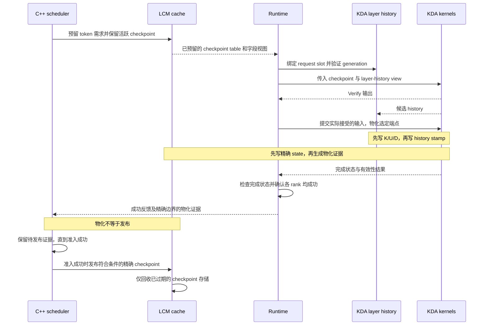
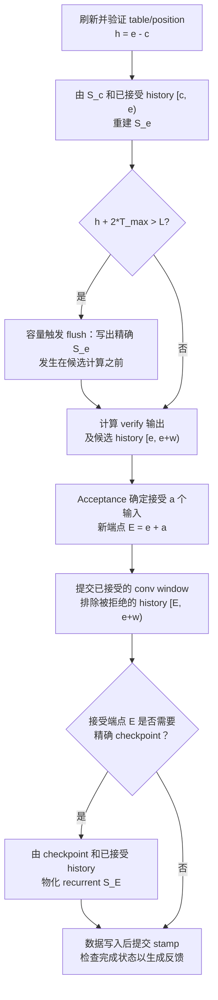

# Kimi-K3 Replay-SSM 重构设计

[English](kda-replay-ssm-design.md) | 简体中文

状态：供讨论的设计提案。希望先与维护者对齐 cache、scheduler 和 KDA 改动的理由、
职责与范围，再确定实现计划。第 3–5 节说明拟议的共享协议；
第 9 节列出需要共同决定的事项。

英文版是规范文本，中文版是同步翻译。两份文档必须在同一个 PR 中更新；若翻译出现
歧义，以英文版为准。

## 1. 问题与范围

Kimi-K3 现有的 speculative 路径先验证一组候选 token，再重放被接受的输入，提交
convolution state 和 recurrent state。普通 decode 则每一步都写回完整的 recurrent
state。当每轮只接受少量 token 时，重复 replay 和完整 state 写回的开销较大。

这与 ReplaySSM 文章用来说明 concurrency 收益的 baseline 不同：TokenSpeed 当前的
Kimi-K3 不保存每个 draft token 的完整 state snapshot。因此，文章中通过消除 per-draft
snapshot 得到的 concurrency recovery 不能直接套用。本设计预期消除的是 acceptance 后的
replay，并摊薄完整 state **写入**；代价是新增每个活跃请求的 history 与 lagging
checkpoint 容量。

当前 speculative accepted-state commit 也在 decode graph replay 之后 eager 执行。
正式替换将 commit 纳入统一的 graph-stable lifecycle，这是本仓库特有的潜在收益，
但必须与 replay/write 减少分开测量，不能直接视为既得加速。

本方案保留一个精确的 recurrent checkpoint，以及 checkpoint 之后紧凑的已接受历史。
Forward 重建当前 state，计算输出并生成候选 history；acceptance 确定后，只提交被接受
的前缀。仅在容量不足或需要精确快照时，才将完整 recurrent state 写回 cache，
下文称为“物化”。这替代了每轮 acceptance 后例行执行的 recurrent replay，
但并不消除 state 重建，也不意味着永远不需要写出端点 state。

主要变化是 decode input cache 的生命周期。当前路径已经缓存 recurrent/conv state，
speculative verify 也有单轮 workspace；它没有跨 decode round 保留 accepted K/U/D
history。正式替换会让这段 accepted history 持久化在各 KDA layer class 管理的
固定容量 buffer 中。LCM 继续管理精确的 recurrent 和 convolution checkpoint：

| 项目 | 当前实现 | Replay-SSM 目标实现 |
| --- | --- | --- |
| 每轮入口的逻辑 state | 使用上一轮写回的精确 recurrent `S_e`。 | 精确 checkpoint `S_c` 加 accepted history `[c,e)` 表示逻辑 `S_e`。 |
| Standard decode | 每个 token 更新并写回完整、精确的 recurrent state。 | 以 `T=1` 使用同一协议；追加一条 accepted history，只在需要时物化完整 state。 |
| Speculative verify | 当前 candidate window 的 projection/intermediate 保存在 per-round workspace。 | 根据重建的 state 产生 candidate K/U/D history `[e,e+w)`。 |
| Acceptance 之后 | 从单轮 workspace replay accepted prefix，并写回精确 `S_e`。 | 将 `[e,e+a)` 提升为 persistent accepted history；排除 rejected `[e+a,e+w)`，不再执行 post-acceptance recurrent replay。 |
| History 生命周期与 owner | Candidate intermediate 只在当前 verify/commit round 有效，属于 backend workspace。 | Accepted history 在同一 live request 的多轮之间保留在 KDA layer 自有 buffer 中；runtime 的 request-slot 生命周期负责初始化和重置。 |
| 完整 state 物化 | Standard 每步写；speculative 每轮 accepted replay 后写。 | 只在 capacity flush、可复用的对齐 checkpoint 或其他明确 snapshot 边界写。 |
| Reuse 范围 | Candidate intermediate 只在当前 round 内复用。 | 同一 live request 的后续 round 复用 accepted history；其他 request 不继承。Prefix reuse 仍从精确 checkpoint 和空 history 开始。 |
| Standard/speculative 关系 | 使用不同的 state-maintenance 行为。 | 共用 prepare → reconstruct → forward → acceptance → commit 协议，只有 `T` 和接受数不同。 |

本文所说的 **history reuse**，是把当前 candidate window 中被接受的部分提升为
request-local storage，并由同一个请求的后续 round 使用；它不表示跨 request 的 prefix
reuse，也不包括 rejected suffix。

普通 decode（`T=1`）和 speculative verify 使用同一套协议。Prefill 仍然读取和输出
精确 state。正式替换的范围聚焦 Blackwell 上的 Kimi-K3：BF16 activation、FP32 recurrent
state、head dimension 128，最大 verify 宽度 `T_max=1` 或 `4`。
计划使用真实 NVFP4 权重、TP8 进行验证；权重精度不改变 state 的精度。

本次替换不包含 output-only attention、sampling/acceptance 规则修改，也不支持在
prefill/decode worker 之间迁移仍携带 buffered history 的活跃请求。仓库已经为部分
Qwen GDN 路径提供 `--enable-replay-ssm` opt-in；本设计不修改或移除该路径，也不以它
作为 KDA 保留 legacy/new selector 的先例。两者未来是否共用 cache/kernel 协议需要
另行设计。其他模型保持零滞后配置和现有行为。

## 2. 上游前提与相关 PR

| 工作 | 状态 | 范围 |
| --- | --- | --- |
| [上游 #1597](https://github.com/lightseekorg/tokenspeed/pull/1597) | 已合并 | 提供精确 computed frontier 和待发布物化边界的跟踪机制。沿用这项基础能力，不重复实现修复。 |
| [Fork #3](https://github.com/byshiue/tokenspeed/pull/3) | 评审中，尚未合并 | 提议通过 `max_state_lag_tokens`、统一回收规则和容量预算，支持有界滞后的 live-state 保留。Replay history、kernel 和 serving 接入不在该 PR 范围内。 |

这两个 PR 是下文共享协议的背景，不代表其余 replay 重构的范围已经确定。

以 #1597 的 `Request::NumComputedTokens()` 作为计算进度边界：decode 时为
`TokenSize() - 1`，不包括最后一个刚采样、尚未作为输入计算的 token。
所有已确认物化的边界都要保留到成功准入并发布为止。

## 3. State 表示与职责划分

精确 record、conv checkpoint 配对和恢复规则见第 9.1 节。K/U/D 均为 FP32；
D 是逐 token、逐 key channel 的乘法 decay，不是累计乘积。

对于每个请求的每个 KDA layer，令 `e` 表示已接受且已经完成计算的输入 token 数，
`c` 为 recurrent checkpoint 的位置，`w <= T_max` 为当前候选窗口宽度：

```text
精确 recurrent S_c + 已接受 history [c, e) = 逻辑 recurrent S_e
                    候选 history [e, e+w) 尚未提交
```

拟议的 history 为每个 token 保存 FP32 normalized key `K`、correction vector `U`
和乘法 decay `D`。KDA 的 decay 按 key channel 变化，不是一个标量。Query 只用于当前输出，
不需要长期保留。被拒绝的候选即使仍有数据留在已分配的内存中，也不属于逻辑 state。

较小的 convolution window 始终对应已接受端点 `e`，recurrent state 则可以停留在
`c`。二者必须结合已接受 history 才能表示当前状态。只有 recurrent state 也物化到
所声明的端点后，才是可用于 prefix reuse 或传输的精确快照。

| 负责方 | 职责 |
| --- | --- |
| LCM cache | 管理精确的 recurrent/convolution checkpoint、内存分配、不可变 prefix snapshot、在途访问保护与回收；不保存 replay history。 |
| C++ scheduler | 管理 token 级 state 需求、有界 checkpoint 保留与准入、精确 checkpoint 发布、请求生命周期和恢复；不分配或检查逐层 replay history。 |
| Runtime 与 KDA layer class | 分配稳定的 request slot 和 generation，管理每层固定容量的 K/U/D history buffer，刷新 graph 地址稳定的 metadata，安全重置复用的 slot，并安排 forward/acceptance/commit。 |
| `tokenspeed-kernel` | 检查 layer-buffer metadata、重建 state、计算输出/history，并写入调用方提供的 state/window/stamp view；无权分配或发布 checkpoint。 |

每个 KDA layer class 管理一个长期存在、地址固定的 replay-history ring。Runtime
分配的 request slot 与 generation 用于索引。它不是 LCM cache group。这是明确的
backend-private state 例外：history 容量固定、只有 KDA 使用、不参与 prefix reuse
或 host transfer，而且只在请求持续存活于同一 worker 时有效。精确 checkpoint
仍由 LCM 管理，以支持 retraction、prefix reuse 和 buffer reset 后的恢复。

## 4. Cache 管理协议

### 有界的 checkpoint 保留范围——fork #3

`max_state_lag_tokens=d` 告诉 allocator：活跃消费者最远还可能读取计算进度之前
多少 token 的 state。它只改变保留范围，不改变 prefix identity 或 state block
粒度。设 state block 跨度为 `G`、进度为 `p`，只有索引小于
`max(0, floor((p-d-1)/G))` 的 block-table slot 才能过期，因为端点 `c` 的 state
位于 `floor((c-1)/G)`。端点为零时使用初始零 state。

准入时估算可回收容量、victim 规划、空间预留和实际回收必须共用这条规则。
否则，准入逻辑可能把活跃 checkpoint 仍在使用的内存误算为可用空间。
启动预算在现有工作集基础上，为每个活跃请求额外预留 `ceil(d/G)` 个 state block。
原有的 prefill input/checkpoint/tail 和 overlap 保护预算仍需保留，不能用 lag
预算替代。

Python cache spec、桥接层、C++ 配置和序列化协议必须显式携带同一个值。
不受影响的 recipe 保持零 lag。Runtime 与 scheduler binding 需要一起重新构建；
协议缺少字段时不能静默猜测一个默认值。

### 请求私有 history——KDA layer buffer

每个 KDA layer 在启动时分配地址固定的 GPU buffer。K、U 和 D 的逻辑 shape 为
`[max_request_slots, L, local_heads, ...]`，另有 per-slot metadata。该分配独立于
LCM page allocation，不增加动态 LCM demand。`max_request_slots` 必须覆盖 worker
上可能同时驻留的最大请求数。如果 runtime 可能耗尽 layer-buffer slot，启动时必须
拒绝该配置。

初始策略使用 history 容量 `L` 和 state lag `d=L-T_max`，并要求
`L >= 2*T_max`。Layer buffer 遵循以下规则：

- Runtime 在请求存活期间分配一个稳定的 request slot。所有 KDA layer 用该 slot
  访问各自的 buffer。
- 每个 slot 保存 generation、checkpoint 位置 `c`、accepted endpoint `e`、
  ring origin 和 position stamp。只有 generation 和绝对 token 位置都匹配时，
  row 才有效。
- Kernel 可以将绝对 token 位置按 `L` 取模映射到物理 row。Position stamp
  防止旧数据或 rejected row 被误当成逻辑 history。
- Candidate history `[e,e+w)` 写入同一 slot。Acceptance 推进 `e`；
  rejected row 保持无效，之后可以覆盖。
- Prefill 和 prefix hit 从 LCM 中的精确 checkpoint 与空的 layer-buffer history
  开始。长 prefill 不为完整 prompt 保存 replay history。
- Slot 复用前必须等待所有在途读写结束。Runtime 随后递增 generation、重置
  metadata，再将 slot 分配给另一个请求。Generation 不匹配属于不变量错误，
  不能解释为空 history。
- History 不参与 LCM prefix publication、canonicalization、host writeback 或
  P-D transfer。只有物化后的精确 checkpoint 可以跨越这些边界。

显存量级可以按每个 head、每个 token 的 FP32 history 计算：
`4*(2*D_k+D_v)` 字节。TP8 下，每张 GPU 有 69 个本地 KDA layer、12 个本地 head，
`D_k=D_v=128`；当 `L=8` 时，每个配置的 request slot 在每张 GPU 上需要约
**9.7 MiB** 的逻辑 K/U/D payload。Layer buffer 在启动时完整分配，因此总量乘以
`max_request_slots`，而不是瞬时活跃请求数。这是理论估算；还要计入 LCM state
block、generation、stamp 和 runtime scratch。增大 `L` 也会增加重建工作量。

## 5. Scheduler 与生命周期改动

Scheduler 仍然只有一条准入/forward 路径，负责逻辑 token 与 cache 需求，
不检查逐层 history，也不为了适配 backend buffer 而缩短 verify 窗口。
是否 flush 仍由设备端的 per-request 数据决定。

除有界 checkpoint 保留外，scheduler 不管理 replay-history demand。Runtime 必须把
请求开始、完成、取消和 retraction 映射到安全的 layer-buffer slot 初始化或重置。
发布机制基于 #1597：只有实际接受的端点已经精确物化，才记录对应的对齐
边界。仅仅跨过边界、分配 block、提交 convolution window 或计划执行 capacity
flush，都不能证明存在可复用的精确快照。准入失败时不能消耗待发布的物化证据；
发布必须先于回收。

生命周期要求如下：

- **Prefill → decode / prefix hit：** 从精确 checkpoint 和空的 layer-buffer history 开始。
  当前 agentic continuation 是通过 prefix matching 进入的新请求，不是活跃请求
  原地执行 `Decoding → Prefilling` 转换。
- **接受端点落在对齐边界：** 先按需物化该实际端点，再报告它可复用；不能声称所有
  被跨过的边界都有 state。
- **Retraction：** 保持现有的精确 prefix checkpoint 恢复和后缀重算机制，
  slot 复用前使 layer-buffer generation 失效；不将 live history 当作精确 state 导出。
- **完成/取消：** 除非需要发布快照，否则不必额外写回最终完整 state。
  所有在途读写完成前保留 slot；完成后递增 generation 并重置 metadata。
- **直接移交活跃请求 / P-D 传输：** 必须在请求静止、无在途读写时，使用最新 table
  物化端点。这些配置不在本次 replacement PR 范围内。未来若支持移交，接收端必须
  分配新的 layer-buffer slot。

GPU 有效性标志通过正常的 forward-result 路径返回。在向 scheduler 报告成功之前，
CPU 侧检查及各 rank 对成功与否的一致性确认必须完成。无效存储或缺失的必要结果
属于 cache 不变量被破坏，不能静默 fallback。Event loop 不发起 GPU 工作，
也不检查设备端 history。

### 从分配存储到发布可复用 checkpoint

下图跟踪一轮实际物化了对齐接受端点的执行，说明职责和依赖顺序，
不表示每轮新增一个同步屏障。开启 overlap 时也必须遵守这些依赖。


```mermaid
sequenceDiagram
    participant S as C++ scheduler
    participant C as LCM cache
    participant R as Runtime
    participant H as KDA layer history
    participant K as KDA kernels
    S->>C: 预留 token 需求并保留活跃 checkpoint
    C-->>R: 已预留的 checkpoint table 和字段视图
    R->>H: 绑定 request slot 并验证 generation
    R->>K: 传入 checkpoint 与 layer-history view
    K-->>R: Verify 输出
    K-->>H: 候选 history
    R->>K: 提交实际接受的输入，物化选定端点
    Note over H,K: 先写 K/U/D，再写 history stamp
    Note over C,K: 先写精确 state，再生成物化证据
    K-->>R: 完成状态与有效性结果
    R->>R: 检查完成状态并确认各 rank 均成功
    R-->>S: 成功反馈及精确边界的物化证据
    Note over S,C: 物化不等于发布
    S->>S: 保留待发布证据，直到准入成功
    S->>C: 准入成功时发布符合条件的精确 checkpoint
    C->>C: 仅回收已过期的 checkpoint 存储
```

只有精确 checkpoint 可以复用，live history 始终属于当前请求。
有效性检查失败时不能报告成功；准入失败时保留证据，供后续尝试使用。

## 6. KDA kernel 与 runtime 接口

接口应区分 per-group metadata 准备、per-layer forward 和 accepted commit，
kernel 统一通过 `tokenspeed-kernel` 暴露。下表定义职责和数据流；
API 命名与物理布局属于实现选择，应在协议达成共识后再评审。

| 阶段 | 输入 | 输出 / 写入行为 |
| --- | --- | --- |
| 准备与验证，每个 group 一次 | 当前 checkpoint table、request slot 与 generation、已接受端点、有效宽度、`L`、`T_max` | 将 checkpoint 位置、history 长度、flush mask 和 layer-buffer 有效性标志写入固定 buffer。 |
| Forward，逐层执行 | Q/K/V 与 gate producer、checkpoint view、layer-owned history view 和准备好的位置 | Verify 输出与写入 request slot 的候选 K/U/D；必要时写出候选计算前的精确 checkpoint。 |
| Accepted commit，各层 forward 之后 | 实际接受的输入数量、候选 payload、endpoint mask、request slot 与 generation | 已接受的 convolution window、选定的精确 recurrent endpoint，以及按顺序写入的 layer-history stamp。 |
| 静止状态下的端点物化，用于未来的活跃请求移交 | 最新请求 table 和已接受端点 | 精确端点 state 与完成有效性；不消费候选，也不要求为下一轮窗口预留空间。这属于后续扩展，活跃请求移交不在本次 replacement PR 范围内。 |

### 一轮 decode 的执行流程

下图针对一个有效、活跃的请求。普通 decode 与 speculative decode 使用同一条
流程，只是窗口宽度和接受数量不同。菱形判断对应 per-request 的设备端 mask，
不是 CPU 分支，也不表示需要不同的 CUDA graph。


```mermaid
flowchart TD
    A["刷新并验证 table/position<br/>h = e - c"]
    B["由 S_c 和已接受 history [c, e)<br/>重建 S_e"]
    C{"h + 2*T_max > L?"}
    D["容量触发 flush：写出精确 S_e<br/>发生在候选计算之前"]
    E["计算 verify 输出<br/>及候选 history [e, e+w)"]
    F["Acceptance 确定接受 a 个输入<br/>新端点 E = e + a"]
    G["提交已接受的 conv window<br/>排除被拒绝的 history [E, e+w)"]
    H{"接受端点 E 是否需要<br/>精确 checkpoint？"}
    I["由 checkpoint 和已接受 history<br/>物化 recurrent S_E"]
    J["数据写入后提交 stamp<br/>检查完成状态以生成反馈"]

    A --> B --> C
    C -->|是| D --> E
    C -->|否| E
    E --> F --> G --> H
    H -->|是| I --> J
    H -->|否| J
```

Forward/重建逐层执行；所有层的 forward 完成后，再执行 acceptance 和选定端点的
commit。`a` 包括 target input，不只是 draft match 数，不能再额外加一。
普通 decode 的 `a=1`；padding 的 `a=0`，不修改状态。被拒绝的数据不必擦除，
只要提交后的端点将其排除即可。

Capacity flush 写出的是**旧的已接受端点 `e`**，绝不包含未接受的候选。
Acceptance 后的 endpoint writer 则在需要精确对齐快照时，物化**新的端点 `E`**。
该快照仍需经过上图的发布流程才能复用。如果不需要端点写回，就继续用
checkpoint 加已接受 history 表示当前状态。

Capacity flush 不需要再做一次额外 recurrence：forward 已经从 `S_c` 和 `[c,e)`
重建出 `S_e`，flush 只是把这个结果写入 cache。这能降低小 `L` 下频繁 flush 的额外
计算成本，但不能消除完整 state 写入流量。

所有写入目标都必须可写，并在写入前完成验证；对应数据就绪后才能提交 stamp。
同一 batch 中混合 flush/no-flush、部分接受和 padding 时，eager 与 CUDA graph
仍执行同一顺序。Metadata 和 scratch 地址保持稳定，容量覆盖 runtime 的最大 batch，
不能只覆盖 graph capture 的几种大小。Mixed prefill/decode batch 中，prefill
仍使用精确 state，decode 后缀使用同一套 commit 协议。

容量在启动时固定，并要求 `L >= 2*T_max`。最终参数名称、容量上限和 recipe 默认值
留待评审决定。容量配置只调整 Replay-SSM 的资源与性能取舍，不能作为切回旧 KDA
实现的模式开关；正式替换后，不支持的硬件、布局或容量组合应在启动时拒绝。

### 为什么提前一个窗口 flush？

正式替换采用的初始策略沿用 [ReplaySSM 第 5.3 节](https://dao-lab.ai/blog/2026/replayssm/#53-speculative-decoding)：
当 `h + 2*T_max > L` 时 flush。其[公开 GDN 实现](https://github.com/Johnny-Liou/ReplaySSM/blob/a84849410ab56cc2b23432969eb2ecfc42a13d9c/vllm/model_executor/layers/fla/ops/gdn_replayssm_spec_decode.py#L382)
也用相同条件准备下一轮的 flush 标志。这里，`h=e-c` 是本轮开始时的已接受 history
长度，`L` 同时容纳 history 和候选；`T_max` 是配置的最大输入窗口，不是实际接受数。

Flush 属于逐层 forward，不是先释放 history 存储、再准入候选窗口的独立阶段。
因此，即使本轮要 flush，进入 forward 时也必须有空间容纳完整窗口：
`h + T_max <= L`。写出 `S_e` 并不代表其他在途操作仍在读取的 history 可以立即复用。

如果本轮不 flush，最多可能接受 `T_max` 个输入。下一轮即使需要 flush，
也必须先有空间容纳自己的候选：

```text
下一轮 history 长度： h_next = h + a，其中 a <= T_max
下一轮容量要求：      h_next + T_max <= L
本轮可不 flush 的条件：h + 2*T_max <= L
```

两个窗口分别预算“本轮可能新增的已接受输入”和“下一轮候选”，不表示两轮同时执行。
这也维持了声明的 state-lag 上界 `d=L-T_max`。如果本轮执行 capacity flush，
checkpoint 前进到 `e`，新 history 只包含本轮接受的输入，因此
`h_next=a <= T_max <= L-T_max`。另行物化精确接受端点时，lag 还可以进一步缩小。

对于 `L=8,T_max=4`，flush 条件简化为 `h>0`。假设从空 history 开始，
且不考虑额外的精确端点写回：

| 轮次 | 开始时的 history 长度 `h` | 是否 capacity flush | 接受数 `a` | Commit 后的 history 长度 |
| --- | --- | --- | --- | --- |
| 1 | 0 | 否 | 2 | 2 |
| 2 | 2 | 是 | 1 | 1 |
| 3 | 1 | 是 | 3 | 3 |
| 4 | 3 | 是 | 3 | 3 |

这里从第二轮开始每轮 flush，符合规则，但失去了跨多轮摊薄完整 state 写回成本的收益。
`L=8` 是 `T_max=4` 时的合法下限，不是推荐的性能配置。若使用 `L=16,T_max=4`，
capacity flush 的条件变成 `h>8`，history 就可以跨多轮累积。
更大的 buffer 也会增加显存和重建工作，容量仍需实测选择，不能认为越大越快。

预留两个窗口是 buffer 生命周期策略，不是 SSM 的数学要求，也不是并行 verify
必然带来的限制；仅改成串行 recurrence 并不能放宽该条件。如果希望采用 `h+w>L`
这样的单窗口条件，需要先完成 flush，并确保旧 history 可以安全释放，再将其空间
用于候选。这涉及执行顺序、在途读者、入口验证，以及 LCM 的保留和准入边界，
必须一起评审；只把 `2*T_max` 改成 `T_max` 会破坏当前的 `h<=L-T_max` 入口约定。
该替代方案应作为独立设计选择讨论。

## 7. 数值约定与优化方向

PR1 评审前固定以下标准，PR2 继续使用。优化完成后不能按结果放宽标准。

| 检查 | 验收标准 |
| --- | --- |
| 独立 FP32 reference | BF16 输出的 atol=2e-2、rtol=2e-2；recurrent state 的 atol=3e-2、rtol=2e-2。同时报告最大误差和 RMS 误差。 |
| 与 main 对照 | 使用相同的输出/state 容差。Conv endpoint、checkpoint position、accepted count 和 padding 副作用必须完全一致。拒绝 NaN/Inf。 |
| 确定性 serving corpus | 固定权重、输入、seed 和生成长度。Standard decode 与 MTP3 的 greedy token 和逐轮 acceptance 必须一致。 |
| AIME 2026 | 使用相同数据、prompt、采样设置和答案解析器。成对的确定性测试中，正确题数不能降低。保留逐题结果。 |
| 性能 | 通过第 9.1 节的固定协议。正确性和性能分别验收。 |

Producer 与 recovery 使用相同的归一化、gate 变换和有序 FP32 更新。
K/U/D 在对应的 FP32 运算后写入。不得转为 BF16，也不提前乘入累计 decay。
本次两项 PR 不包含改变结合顺序的 Tensor Core 重建。

测试失败时先定位原因并修改实现。改变数值契约需要独立的设计决定。
代数等价不代表浮点结果或 acceptance 一致。

## 8. 预期收益与代价

预期收益是消除 acceptance 后的 replay、摊薄完整 state 写入，并把 accepted commit
纳入统一、graph-stable 的 decode lifecycle。它不是文章中“移除 per-draft state
snapshot”的 concurrency 优化，因为当前 Kimi-K3 baseline 本来就没有这些 snapshot。

每个 head 的完整 state 有 `D_k*D_v` 个元素，一条 history 有 `2*D_k+D_v` 个元素。
维度为 128、使用 FP32 时，两者分别为 64 KiB 和 1.5 KiB，单条 history 约小 43 倍。
这是用较小的 per-token storage 换取较少 full-state write 的依据，不是端到端加速比例。

这项交换必须同时计算以下代价：

- Output-only attention 不在范围内，因此每轮仍会读取完整 `S_c` 并重建 `S_e`；完整
  state 的 read traffic 不会减少，重建读取与算术随 `h` 增长。文章中叠加 output-only
  后接近减半的 state-traffic 结论不能直接套用。
- TP8 下，`L=8` 的 K/U/D payload 约为 9.7 MiB/request/GPU，因此 `L=16` 约为
  19.4 MiB/request/GPU；若有 256 个 live request，history 单项约为 4.85 GiB/GPU。
  这个估算还不包含 lag checkpoint、stamp、page rounding、candidate/overlap 保护和
  runtime scratch。
- Live checkpoint 的 lag 上限为 d=L-T_max；可用于 prefix recovery 的 checkpoint
  没有这个上限。恢复成本取决于已发布 prefix 是否仍可用，应记录实际重算 token 数。
- 更大的 `L` 可能减少 flush 和完整 state 写入，也会增加显存、history 读取与重建工作；
  额外 metadata/commit launch 也可能抵消 kernel 收益。

因此，正式 PR 必须执行 `L ∈ {8,16,32}` 与目标 concurrency 的交叉 sweep，同时报告
latency、吞吐、GPU memory、flush 频率、retraction 恢复成本和 acceptance。Recipe
默认值只能根据这组数据决定。上述内容都是需要验证的假设，不是性能承诺；正式替换
只有在约定的正确性和 E2E 性能标准通过后才能合入，不能用长期保留新旧两套实现和
运行时开关代替验收。

## 9. 待对齐事项与交付验收

继续推进前，cache、scheduler 和 KDA 维护者应先讨论：对于目标工作负载，
减少完整 state 写回和 replay 的预期收益，是否值得增加这些存储与重建成本。
之后再对齐以下事项：

1. 有界 lag 的语义、统一的过期规则，以及 #1597 精确 frontier 下的准入/启动预算。
2. Layer-owned request history 的固定容量、request-slot generation 与重置规则、
   显存预算，以及不参与 prefix reuse/host writeback 的限制。
3. 发布证据和完成顺序：什么能证明存在精确 state、准入失败时如何保留证据，
   以及 overlap 如何保护仍在使用的存储。
4. 生命周期边界：基于精确 state 的恢复、取消时的在途保护，以及在所有权管理层
   完成接入前，继续禁止直接移交活跃请求和 P-D 传输。
5. 数值范围：两项 PR 都必须通过第 7 节的固定数值、acceptance、AIME 和性能标准。
6. 正式替换范围：支持的 shape 和容量、公共 API 边界、`L ∈ {8,16,32}` × 目标
   concurrency 的 sweep 计划，以及哪些 kernel 优化应留作独立的后续工作。

### 9.1 两个实现 PR

每个合入版本只有一条 serving 路径，不增加新旧实现的环境变量、CLI 或 runtime 开关。
#1597 是两项 PR 的前提；fork #3 的有界 checkpoint retention 是 PR2 的前提。

#### 共用的 replay record

Record 保存 FP32 归一化 K、correction U 和逐 token、逐 key channel 的乘法 decay D。
D 不是跨 token 的累计乘积。对于 [value_dim, key_dim] state：

```text
S_(i+1) = S_i * D_i[None, :] + U_i[:, None] * K_i[None, :]
```

vLLM Kimi-K3 源码使用 FP32 correction 和 activation dtype 的原始 key/gate。
本地适配在 producer 中生成上述标准 record，保留 Apache-2.0 许可。
这不是将 GDN 的 scalar decay 直接用于 KDA。

Recovery 接口为 (S_c, record_view, c, E)。View 包含 stride、容量 R、
request slot、generation 和绝对位置 stamp。位置 i 映射到 i % R。
PR1 使用 R=T_max，每轮从 c=e 开始；PR2 改为 R=L，并延长 accepted record 的寿命。

PR1 合入前必须验证 record 可跨窗口组合。后续窗口必须由真实 verify producer
从前一轮重建 state 生成，不能全部使用 reference 预制的 record。
测试至少 128 轮，覆盖 T=1/4、全部 accepted length、padding、mixed batch、
R=8/16/32、wraparound、rejected suffix、checkpoint reset、旧 generation 和 slot reuse。
比较输出、recurrent/conv endpoint 和 stamp。PR1 serving 仍只保留单轮 record。

#### PR1：替换单轮 accepted-state replay

```text
verify → 写入单轮 record → acceptance → 一次共享 plan
       → 跨层 recurrent recovery + conv commit → 精确 endpoint
```

PR1 保持 LCM、scheduler 和 standard decode 的现有语义。每轮写回精确 recurrent/conv state。
规划只执行一次，生成 accepted length、源/目标 state ID、aligned-boundary length 和 mask。
预计 commit 包含一次 planner、一次跨层 recurrent recovery、一次跨层 conv commit。
同一 PR 删除被替换的旧 replay kernel 和 orchestration。

Verify 可在 decode graph 内执行。Acceptance 后的 commit 仍按当前顺序 eager 执行。
Eager/graph 使用同一 buffer 和 commit 入口。完整 commit graph 属于 PR2。

所有 record、plan、pointer buffer 在 capture 前分配，覆盖最大 runtime batch，
包括高于 graph ladder 的 eager batch。Padding accepted count 为零，不访问 live state。
Pool rebind 后重建 pointer table 和 workspace，再重新 capture。
仅在 commit 完成后复用单轮 workspace。

FP32 record 的每 GPU 字节数为：

```text
layers * max_runtime_batch * T_max * heads * 4*(2*D_k+D_v)
```

69 层、12 local heads、维度 128、T_max=4 时，每个配置 batch slot 约 4.85 MiB。
另计 conv payload、pointer、plan 和临时存储。启动内存预算必须包含这些分配。

验证包含第 7 节、多窗口组合、aligned boundary、读写 alias、padding、mixed batch、
idle graph、超过 capture ladder 的 batch、rebind 和 overlap。
完整模型使用真实 Kimi-K3 NVFP4、TP8、standard decode、MTP3、agentic workflow 和 AIME 2026。

#### 固定性能协议

- Baseline 是本次 rebase 对应的未修改 remote main，记录完整 commit。
- 两组使用相同 GPU、频率/功耗策略、容器、依赖、权重、模型设置和输入。
- KDA 测量完整 verify+commit：B=4/8/16/32、T=1/4、accepted length=1..T。
- E2E 使用 concurrency 4/8/16/32，两组开启 decode CUDA graph。
- 每组至少十次独立启动，交替执行；每次预热，保留原始逐请求数据。
- 报告 median/p99 TPOT、吞吐、acceptance、GPU memory 和 workspace。
- 对成对启动的 log ratio 做 10,000 次 bootstrap。使用每次重采样的最大标准化偏差，
  生成覆盖全部 cell 和 gated metric 的 simultaneous 95% interval。
- 延迟比值上界不得超过 1.02；吞吐比值下界不得低于 0.98。
  统计显著的退步即使小于 2% 也不通过。2% 是测量不确定度，不是容许性能损失。
- 首批结果不明确时，按预先约定追加十次启动。仍不明确则标记未通过验收，
  不在结果首次通过时提前停止。
- KDA 改善不能抵消 E2E 退步。记录命令、环境、commit、结果和 artifact 路径。

#### PR2：保留跨轮 accepted history，统一 decode

PR2 将相同 record 放入逐 KDA layer 的固定地址 ring，使用 runtime request slot 和 generation。
Standard decode 使用 T=1；speculative decode 使用较宽窗口。共用同一生命周期。
加入 h+2*T_max>L 的 capacity flush、accepted-only history、精确 endpoint 物化和
有界 checkpoint retention。删除不需要 snapshot 时的逐轮 exact-state commit。

执行顺序为 metadata refresh → forward graph → acceptance → commit graph → completion/feedback。
Acceptance 可保留当前机制，但必须在 commit graph 前把 accepted count 写入固定地址 device buffer。
Eager 调用相同入口。Per-request flush 由 device mask 决定。

每层固定地址 conv workspace 保存 round-entry window 和 raw candidate inputs，
尺寸覆盖最大 runtime batch、channel、conv width 和 T_max；commit 完成前不能覆盖。
Scheduler 在 forward 前按现有 speculative demand 预留窗口可能需要的 aligned destination，
acceptance 在这些 destination 中选择。未使用块按现有规则回收；kernel 不临时分配块。

Active batch row 映射到稳定 request slot。Padding 使用专用 null slot，禁止任何 state/history/stamp 写入。
Slot 存储覆盖 resident request 上限，row metadata 覆盖 runtime batch 上限。
Rebind 或替换 slot 存储后，作废 graph 和 pointer table，重置 generation 并重新 capture。

Live conv window 位于 e；精确 checkpoint 的 conv/recurrent 必须位于同一 endpoint。
LCM 预留独立的 writable conv continuation block；若使用现有预算，启动时必须检查覆盖关系。
Flush 写入未发布的 destination；只有旧 checkpoint 未发布且读者已结束时才允许原地更新。
Published checkpoint 不可修改。发布证据必须等待 recurrent 和 conv 均完成。
Capacity flush 本身不发布 prefix。Retraction 继续从可用的 published prefix 恢复，
或从更早位置重算；private flush state 不是新的 recovery source。

分别对 T_max=1 和 T_max=4 recipe 执行 L=8/16/32 sweep。
每个可用于 serving 的容量必须通过正确性，并在每个 cell/metric 上相对 PR1 和 main 均无退步。
对 main 的各 concurrency 吞吐比值取等权 geometric mean，
按完整 paired-start vector bootstrap；simultaneous 95% 下界必须大于 1 才能宣称收益。
选择 aggregate 吞吐点估计距最佳 passing capacity 不超过 2% 的最小容量。
L=8 没有豁免；失败容量只能留在测试中。没有容量通过则不能合入 PR2。

两项 PR 在开发期间保留设计文件，完成验证和评审后再清理。
Live handoff/P-D、output-only/window-parallel KDA、动态 L 和 GDN/Qwen 推广留作后续设计。

## 参考资料

- [Cache 概念](cache-concepts.md)、[Scheduler](scheduler.md)、
  [统一执行路径](unified_path.md)、[Event loop](event-loop.md)。
